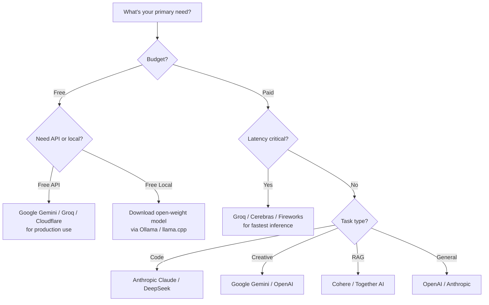
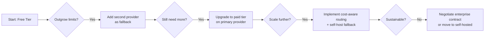

# AI Model Providers and Free Tiers — Complete Guide (2026)

> A comprehensive directory of every major AI model provider, their models, pricing, and — most importantly — **every free tier offering**. Updated for mid-2026.

---

## Table of Contents

1. [Introduction](#1-introduction)
2. [Major API Providers — Free Tiers Detailed](#2-major-api-providers--free-tiers-detailed)
   - [OpenAI](#openai)
   - [Anthropic](#anthropic)
   - [Google Gemini](#google-gemini)
   - [DeepSeek](#deepseek)
   - [Mistral AI](#mistral-ai)
   - [Groq](#groq)
   - [OpenRouter](#openrouter)
   - [Together AI](#together-ai)
   - [Replicate](#replicate)
   - [Hugging Face Inference API](#hugging-face-inference-api)
   - [GitHub Models](#github-models)
   - [Cloudflare Workers AI](#cloudflare-workers-ai)
   - [Perplexity API](#perplexity-api)
   - [Cohere](#cohere)
   - [xAI / Grok](#xai--grok)
   - [Fireworks AI](#fireworks-ai)
   - [Cerebras](#cerebras)
   - [SambaNova](#sambanova)
   - [NVIDIA NIM](#nvidia-nim)
   - [Lepton AI](#lepton-ai)
   - [AI21 Labs](#ai21-labs)
   - [Google Colab](#google-colab-free-gpu-for-ml)
3. [Open-Weight Models (Self-Hostable / Local)](#3-open-weight-models-self-hostable--local)
4. [Provider Comparison Table — Free Tier Generosity](#4-provider-comparison-table--free-tier-generosity)
   - [Rate Limit Comparison for Free Tiers](#rate-limit-comparison-for-free-tiers)
5. [Best Free AI Models by Use Case — 2026](#5-best-free-ai-models-by-use-case--2026)
   - [API Compatibility and Migration Guide](#api-compatibility-and-migration-guide)
6. [Quick Reference: Sign Up Links](#6-quick-reference-sign-up-links)
7. [Provider Selection Decision Guide](#7-provider-selection-decision-guide)

---

## 1. Introduction

The AI model provider landscape has expanded dramatically. As of mid-2026, there are **20+ major API providers**, most offering some form of **free tier** — whether as free credits on signup, rate-limited free access, or completely free models. Additionally, **open-weight models** from Meta, Mistral, Google, Alibaba, Microsoft, and others enable fully free self-hosted inference.

This document catalogs every provider, their free tier, and what you can actually do with it — from hobby projects to production prototypes.

---

## 2. Major API Providers — Free Tiers Detailed

---

### OpenAI

**Parent:** OpenAI, Inc.
**Models:** GPT-4o, GPT-4o-mini, GPT-4.1, GPT-4.1-mini, o1, o3, o4-mini, o4-mini-high
**Website:** https://platform.openai.com

| Tier | What You Get | Limits |
|------|-------------|--------|
| **Free (ChatGPT)** | GPT-4o-mini via chat.openai.com | Rate-limited, no API access |
| **Free API Credits** | $5–$10 free credits on signup (one-time) | Must add billing method; credits expire after 3 months |
| **GPT-4o-mini** | Cheapest paid option: $0.15/1M input, $0.60/1M output | Pay-as-you-go |

**Free Tier Verdict:** ❌ No free API tier. Only the web chat is free. For API, you must pay (starting at ~$0.15/1M tokens for GPT-4o-mini).

**Notable:** OpenAI offers the **Assistants API** (RAG + code interpreter + tools) starting at the same token rates. GPT-4o-mini is cost-effective for many use cases.

---

### Anthropic

**Parent:** Anthropic PBC
**Models:** Claude 4 Opus, Claude 3.5 Sonnet (best overall), Claude 3.5 Haiku (fast/cheap)
**Website:** https://console.anthropic.com

| Tier | What You Get | Limits |
|------|-------------|--------|
| **Free (claude.ai)** | Claude 3.5 Sonnet via web chat | Rate-limited; ~20–50 messages per day depending on load |
| **Free API Credits** | $5 free credits on first API usage (one-time) | Expires after 30 days |
| **API Pricing** | Haiku: $0.80/$4.00 · Sonnet: $3/$15 · Opus: $15/$75 | Per 1M tokens (input/output) |

**Free Tier Verdict:** ⚠️ Partial free. Web chat is free (rate-limited). API has a one-time $5 credit that is very limited for Sonnet/Opus but useful for testing Haiku.

**Notable:** Claude 3.5 Sonnet is widely considered the best overall model for code generation and complex reasoning. Haiku offers the best speed-to-quality ratio in its price bracket.

---

### Google Gemini

**Parent:** Google DeepMind / Google Cloud
**Models:** Gemini 2.5 Pro (flagship), Gemini 2.5 Flash (fast), Gemini 2.0 Flash, Gemini 1.5 Pro/Flash
**Website:** https://ai.google.dev

| Tier | What You Get | Limits |
|------|-------------|--------|
| **Free Tier (API)** | Gemini 2.0 Flash (full access) | **60 requests per minute** — very generous |
| **Free Tier Pro** | Gemini 1.5 Pro (limited) | 2 requests per minute |
| **Free (Gemini App)** | Gemini 2.5 Flash via web/mobile app | No rate limit visible to end users |
| **Pay-as-you-go** | Gemini 2.5 Flash: $0.15/$0.60 · 2.5 Pro: $1.25/$10.00 | Per 1M tokens |

**Free Tier Verdict:** ✅ **Excellent free tier.** Gemini 2.0 Flash is completely free at 60 RPM — enough for many real applications, automation scripts, and prototyping. This is the most generous free API tier from a major provider.

**Notable:** Gemini has the longest context window (1M–2M tokens) among major providers, free tier included. Multimodal (text + image + audio + video).

---

### DeepSeek

**Parent:** DeepSeek (High-Flyer / China)
**Models:** DeepSeek-V3 (general), DeepSeek-R1 (reasoning), DeepSeek-Prover (math), Janus (multimodal)
**Website:** https://platform.deepseek.com

| Tier | What You Get | Limits |
|------|-------------|--------|
| **Free Chat** | DeepSeek-V3 + R1 via chat.deepseek.com | Rate-limited, no API access |
| **API Free Credits** | ¥5M tokens (~$0.70 equivalent) free on signup | One-time |
| **API Pricing** | V3: $0.27/$1.10 · R1: $0.55/$2.19 | Per 1M tokens — **cheapest frontier class** |

**Free Tier Verdict:** ⚠️ Limited free API credits, but **paid API is the cheapest among frontier models**. DeepSeek-V3 is competitive with GPT-4o at 10–20× lower cost. R1 rivals o1-style reasoning at 5–10× less.

**Notable:** All DeepSeek models are open-weight (MIT license). You can self-host them completely free. DeepSeek-V3 was trained for ~$5.5M — a 10× cost reduction vs GPT-4.

---

### Mistral AI

**Parent:** Mistral AI (France)
**Models:** Mistral Large 2, Mistral Small, Mistral Medium, Codestral, Pixtral, Ministral
**Website:** https://console.mistral.ai

| Tier | What You Get | Limits |
|------|-------------|--------|
| **Free (Le Chat)** | Mistral models via chat interface | Rate-limited; ~50 messages/day |
| **Free API Tier** | Mistral Small + Codestral (paid: $0.20/$0.60 per 1M) | **Completely free tier**: 500K tokens/day for Mistral Small |
| **API Pricing** | Mistral Small: $0.20/$0.60 · Mistral Large: $2/$6 | Per 1M tokens |

**Free Tier Verdict:** ✅ **Good free API tier.** The free Mistral Small tier (500K tokens/day) is usable for small apps, testing, and learning. Le Chat gives free web access to all Mistral models.

**Notable:** Mistral models are open-weight (Apache 2.0). Codestral is specialized for code generation. Pixtral is multimodal.

---

### Groq

**Parent:** Groq, Inc.
**Models:** Llama 3.3 70B, Llama 4 Scout, DeepSeek-R1 (distilled), Mixtral 8x7B, Gemma 2, Whisper (speech)
**Website:** https://console.groq.com

| Tier | What You Get | Limits |
|------|-------------|--------|
| **Free Tier** | All open models (Llama, Mixtral, Gemma, DeepSeek distilled) | **30 requests per minute, 14,400 requests/day** on free tier |
| **Groq Book** | Paid tier with higher rates, priority access | Per-request or subscription |

**Free Tier Verdict:** ✅ **Excellent free tier.** 30 RPM is generous. Groq's LPU hardware provides the **fastest inference speeds** anywhere — often 1,000+ tokens/second. Perfect for real-time apps, chatbots, and testing.

**Notable:** Free tier includes **Llama 3.3 70B** (one of the best open models). Groq does not train its own models — it provides ultra-fast inference for open-weight models.

---

### OpenRouter

**Parent:** OpenRouter (independent)
**Models:** Aggregates 200+ models from all providers — OpenAI, Anthropic, Google, Meta, Mistral, DeepSeek, Cohere, and many more
**Website:** https://openrouter.ai

| Tier | What You Get | Limits |
|------|-------------|--------|
| **Free Trial Credits** | $1 free credit on signup (no credit card) | One-time |
| **Free Models** | Some community-hosted models are free | Rate-limited |
| **Pay-as-you-go** | Access to all 200+ models at provider pricing | Per-token billing |

**Free Tier Verdict:** ⚠️ Minimal free credits but **no credit card required** to start testing. The real value is having 200+ models under one API key with consistent format.

**Notable:** OpenRouter provides **fallback routing** (if one provider's model is down, it routes to another). Unified OpenAI-compatible API. Some free community-hosted models for testing.

---

### Together AI

**Parent:** Together Computer, Inc.
**Models:** Llama 4, DeepSeek, Qwen, Mistral, Gemma, and 100+ open models
**Website:** https://together.ai

| Tier | What You Get | Limits |
|------|-------------|--------|
| **Free Credits** | $5–$25 free credits on signup (varies) | One-time; expires after 30 days |
| **Pay-as-you-go** | From $0.10/1M tokens for small models | Per-token |

**Free Tier Verdict:** ⚠️ Good one-time credits for testing. Can run many experiments with $25 in credits.

**Notable:** Together specializes in **fast inference for open models**. Supports fine-tuning APIs. Many models available at fractional costs.

---

### Replicate

**Parent:** Replicate, Inc.
**Models:** 10,000+ community models (Llama, Stable Diffusion, Whisper, CogView, music gen, video gen, etc.)
**Website:** https://replicate.com

| Tier | What You Get | Limits |
|------|-------------|--------|
| **Free Tier** | Run any model with rate limits | **~5–10 free predictions per day** depending on model |
| **Free Credits** | $5 free credits on signup | One-time |

**Free Tier Verdict:** ✅ **Good free tier for experimentation.** Daily free predictions allow testing almost any model. Best for image, audio, video generation models (not just LLMs).

**Notable:** Replicate hosts both language and **generative media models** (Stable Diffusion, FLUX, music gen, video gen). Pay-as-you-go pricing is per-second of compute.

---

### Hugging Face Inference API

**Parent:** Hugging Face, Inc.
**Models:** 200,000+ open models (all of Hugging Face Hub)
**Website:** https://huggingface.co/inference-api

| Tier | What You Get | Limits |
|------|-------------|--------|
| **Free (Serverless)** | Any model on the Hub via inference endpoint | **30K input tokens + 30K output tokens per month** (free) |
| **Free (Inference Endpoints)** | 1 free CPU endpoint | Always free, but CPU only (very slow for LLMs) |
| **Pro** | $9/month — higher rate limits, GPU endpoints | Subscription |

**Free Tier Verdict:** ⚠️ Very limited tokens per month for serverless. The CPU endpoint is free but impractical for LLM inference. Best for: testing small models, embedding models, and non-LLM modalities.

**Notable:** Hugging Face Spaces allows deploying your own Gradio/Streamlit apps for free. The Hub itself has **100K+ free models** you can download for local use.

---

### GitHub Models

**Parent:** GitHub (Microsoft)
**Models:** GPT-4o, GPT-4o-mini, o1, o3-mini, Llama 4, Mistral, DeepSeek, Phi-4, Gemma
**Website:** https://github.com/marketplace/models

| Tier | What You Get | Limits |
|------|-------------|--------|
| **Free Tier** | AI chat playground with all models | **No credit card required** |
| **Free API** | API keys for development and testing | ~5–10 requests/hour; not for production |
| **Azure Pay-as-you-go** | Full Azure OpenAI rates | Through Azure subscription |

**Free Tier Verdict:** ✅ **Good for learning.** Free API allows testing any major model without a credit card. Useful for prototyping, but rate limits are too low for real apps.

**Notable:** GitHub Models bridges the gap between playground and production — same API key can upgrade to Azure OpenAI for production. Supports both OpenAI and open models.

---

### Cloudflare Workers AI

**Parent:** Cloudflare, Inc.
**Models:** Llama 4, Mistral, DeepSeek, Qwen, Stable Diffusion, Whisper, embeddings, and 40+ models
**Website:** https://developers.cloudflare.com/workers-ai

| Tier | What You Get | Limits |
|------|-------------|--------|
| **Free Tier** | All models via Workers AI | **10,000 neurons per day** (1 neuron ≈ 1 text generation or ~10 embeddings) |
| **Paid** | $5/month for 500K neurons | $0.50/1M additional neurons |

**Free Tier Verdict:** ✅ **Excellent free tier** for lightweight applications. 10K neurons/day is enough for a personal assistant, chatbot, or small automation. Deeply integrated with Cloudflare Workers ecosystem (serverless functions at the edge).

**Notable:** Runs inference in **200+ edge locations** worldwide — ultra-low latency. No setup required; one API call from any Workers function. Best free tier for developers already using Cloudflare.

---

### Perplexity API

**Parent:** Perplexity AI
**Models:** Perplexity Sonar (small/large), Sonar Pro (with search grounding)
**Website:** https://docs.perplexity.ai

| Tier | What You Get | Limits |
|------|-------------|--------|
| **Free Tier** | Perplexity Sonar via API | **5–10 free requests per day** |
| **Free Web** | Perplexity search + AI via web/app | Unlimited AI search |

**Free Tier Verdict:** ⚠️ Very limited API free tier, but **Perplexity's key differentiator is search-grounded answers** (real-time web search + LLM synthesis). The web product is excellent for research.

**Notable:** Perplexity models include automatic web search. Useful for RAG-like applications without building a vector database.

---

### Cohere

**Parent:** Cohere, Inc.
**Models:** Command R+ (RAG-optimized), Command R, Command R7, Embed (multilingual embeddings), Rerank
**Website:** https://dashboard.cohere.com

| Tier | What You Get | Limits |
|------|-------------|--------|
| **Free Trial** | API access to all models | **100 trials per day** (rate-limited) |
| **Free Embeddings** | Embed English/multilingual | 100K free embeddings per month |
| **Pay-as-you-go** | Command R: $0.50/$1.50 · R+: $2.50/$10.00 | Per 1M tokens |

**Free Tier Verdict:** ⚠️ Limited for generation (100 trials/day) but **generous for embeddings** (100K/month free). The Rerank API is also available on the free tier.

**Notable:** Cohere specializes in **enterprise RAG**. Their models optimize for retrieval-augmented generation with explicit citation capabilities. Embed v3 is top-tier for multilingual embeddings.

---

### xAI / Grok

**Parent:** xAI (Elon Musk)
**Models:** Grok 3, Grok 3-mini, Grok 2
**Website:** https://x.ai

| Tier | What You Get | Limits |
|------|-------------|--------|
| **Free (X/Twitter)** | Grok 3 via X Premium (limited free tier) | **10 messages per 2 hours** on free X account |
| **X Premium** | Grok 3 unlimited | $8–$16/month |
| **API** | Grok models via xAI API | Pay-as-you-go (competitive pricing) |

**Free Tier Verdict:** ⚠️ Very limited. The free Grok tier via X is mainly for social features, not development.

**Notable:** Grok 3 has real-time web access via X. xAI API is OpenAI-compatible.

---

### Fireworks AI

**Parent:** Fireworks AI, Inc.
**Models:** Llama 4, Mixtral, Qwen, DeepSeek, Gemma, Phi, and many open models
**Website:** https://fireworks.ai

| Tier | What You Get | Limits |
|------|-------------|--------|
| **Free Credits** | $5–$10 free credits on signup | One-time |
| **Free Tier** | Some models have free inference tiers | Rate-limited |

**Free Tier Verdict:** ⚠️ One-time credits. Main value is fast inference for open models.

**Notable:** Fireworks specializes in **production-grade inference** with low-latency and high-throughput. Supports function calling, streaming, and fine-tuning.

---

### Cerebras

**Parent:** Cerebras Systems
**Models:** Llama 3.1 70B, Llama 3.3 70B, DeepSeek-R1 distilled, others
**Website:** https://cerebras.ai/inference

| Tier | What You Get | Limits |
|------|-------------|--------|
| **Free Tier** | Llama 3.3 70B, DeepSeek R1 distilled | **Free inference** — rate-limited but generous |
| **Pay-as-you-go** | Higher rate limits, priority | Per-token |

**Free Tier Verdict:** ✅ **Excellent free tier.** Cerebras provides free inference at speeds faster than most paid services (thanks to their wafer-scale chip). The free Llama 3.3 70B access is genuinely useful.

**Notable:** Cerebras claims the fastest inference hardware in the world. Free tier is competitive with Groq in speed.

---

### SambaNova

**Parent:** SambaNova Systems
**Models:** Llama 4, Llama 3.1 405B, DeepSeek-V3, Qwen 2.5, other open models
**Website:** https://sambanova.ai/developer

| Tier | What You Get | Limits |
|------|-------------|--------|
| **Free Tier** | Llama 3.1 405B, Llama 4, others | **Free inference** — rate-limited |
| **Pay-as-you-go** | Higher rate limits, enterprise support | Per-token |

**Free Tier Verdict:** ✅ **Excellent free tier.** Free access to **Llama 3.1 405B**, the largest open-weight model. Fast inference on SN40L hardware.

**Notable:** SambaNova provides free inference for the **giant 405B models** that would be expensive to run elsewhere.

---

### NVIDIA NIM

**Parent:** NVIDIA Corporation
**Models:** Llama 4, Mixtral, Mistral, Gemma, Nemotron, Phi, and 100+ optimized models
**Website:** https://build.nvidia.com

| Tier | What You Get | Limits |
|------|-------------|--------|
| **Free Tier** | Access to all NIM microservices | **Rate-limited free tier** for development and evaluation |
| **Pay-as-you-go** | Through NVIDIA AI Enterprise or cloud partners | Various |

**Free Tier Verdict:** ✅ **Good free tier.** NVIDIA provides free access to optimized versions of many open models. The NIM containers can also be self-hosted for free.

**Notable:** NVIDIA NIM provides **optimized inference containers** you can run on any NVIDIA GPU. Free for development use.

---

### Lepton AI

**Parent:** Lepton AI, Inc. (founded by Jia Li, creator of Caffe)
**Models:** Llama, DeepSeek, Mistral, Qwen, and custom deployments
**Website:** https://lepton.ai

| Tier | What You Get | Limits |
|------|-------------|--------|
| **Free Credits** | $10 free credits on signup | One-time |
| **Pay-as-you-go** | From $0.08/hour for GPU inference | Per-second billing |

**Free Tier Verdict:** ⚠️ Decent one-time credits. Main value is **serverless GPU deployment** — deploy any model with a Python script.

**Notable:** Lepton focuses on **developer-friendly model deployment**. Full OpenAI-compatible API. GPU pricing is per-second.

---

### AI21 Labs

**Parent:** AI21 Labs (Israel)
**Models:** Jamba 1.5 (large/mini), Jurassic-2
**Website:** https://studio.ai21.com

| Tier | What You Get | Limits |
|------|-------------|--------|
| **Free Tier** | Jamba 1.5 Mini | **10,000 free requests per month** |
| **Free Credits** | $5 free credits for higher models | One-time |
| **Pay-as-you-go** | Jamba 1.5 Large: $2.50/$8.00 | Per 1M tokens |

**Free Tier Verdict:** ⚠️ Decent for testing. Jamba 1.5 Mini is a good small model for simple tasks. 10K requests/month works for personal projects.

**Notable:** Jamba 1.5 uses a **hybrid Mamba-Transformer architecture** — more efficient than pure Transformer for long contexts. 256K context window.

---

### Google Colab (Free GPU for ML)

**Parent:** Google
**Provides:** Free GPU (T4 / sometimes L4) for running models, fine-tuning, inference
**Website:** https://colab.research.google.com

| Tier | What You Get | Limits |
|------|-------------|--------|
| **Free Tier** | T4 GPU (16GB VRAM) | **Up to 12 hours** session; disconnected after long inactivity |
| **Colab Pro** | $10/month — higher priority GPUs, better runtime | 24-hour sessions |
| **Colab Pro+** | $50/month — L4/A100 GPUs, always-connected runtime | Priority access |

**Free Tier Verdict:** ✅ **Essential free tool.** The T4 GPU is powerful enough to run 7B–8B parameter models (quantized) and fine-tune smaller models. Perfect for learning, experimentation, and prototyping.

**Notable:** Colab is **not an API provider** — it's an interactive notebook environment. But it can run `llama.cpp`, `vLLM`, `Ollama`, and any Python inference code for free on GPU.

---

## 3. Open-Weight Models (Self-Hostable / Local)

These models are free to download and run yourself (local or on your own GPU). **Zero API costs** if you have the hardware.

### Flagship Open-Weight Models

| Model | Creator | Size | License | Free? | Notes |
|-------|---------|------|---------|-------|-------|
| **Llama 4 Scout** | Meta | 17B (MoE) | Llama 4 Community | ✅ | 10M context, multimodal |
| **Llama 4 Maverick** | Meta | 17B (MoE) | Llama 4 Community | ✅ | Best Llama 4 variant |
| **Llama 3.3 70B** | Meta | 70B | Llama 3 Community | ✅ | One of the best small opens |
| **Llama 3.1 405B** | Meta | 405B | Llama 3 Community | ✅ | Largest open-weight model |
| **DeepSeek-V3** | DeepSeek | 671B (MoE, 37B active) | MIT | ✅ | Competitive with GPT-4o |
| **DeepSeek-R1** | DeepSeek | 671B / distilled 1.5B–70B | MIT | ✅ | Open reasoning model |
| **Mistral Large 2** | Mistral AI | 123B | Apache 2.0 | ✅ | Excellent code + reasoning |
| **Mistral Small 3** | Mistral AI | 24B | Apache 2.0 | ✅ | Good efficiency |
| **Mixtral 8x22B** | Mistral AI | 141B (MoE) | Apache 2.0 | ✅ | Strong MoE model |
| **Qwen 2.5 72B** | Alibaba | 72B | Apache 2.0 | ✅ | Strong multilingual, reasoning |
| **QwQ-32B** | Alibaba (Qwen) | 32B | Apache 2.0 | ✅ | Strong reasoning (rivals R1) |
| **Gemma 3 27B** | Google | 27B | Gemma | ✅ | Google's open model |
| **Phi-4** | Microsoft | 14B | MIT | ✅ | Small but capable |
| **Phi-4-mini** | Microsoft | 5B | MIT | ✅ | Tiny, runs on laptop |
| **Command R** | Cohere | 35B | CC BY-NC | ✅ | RAG-optimized |
| **Command R+** | Cohere | 104B | CC BY-NC | ✅ | Strong for enterprise RAG |
| **OLMo 2** | AI2 | 7B/13B | Apache 2.0 | ✅ | Fully open (data+training too) |

### How to Run Them for Free

| Method | Cost | Capability |
|--------|------|------------|
| **Ollama** | Free (local) | Run any GGUF model locally — 7B on CPU, 8B+ on GPU |
| **llama.cpp** | Free (local) | CPU-optimized inference. Quantized 70B on 48GB RAM |
| **vLLM** | Free (local) | Production-grade serving for GPU. Best for serving APIs |
| **Hugging Face Transformers** | Free | Python-native inference on any hardware |
| **ExLlamaV2** | Free | Fastest GPU inference for Llama-family models |
| **MLX** | Free (Apple Silicon) | Optimized for Mac M-series chips |
| **KoboldCPP** | Free (local) | User-friendly llama.cpp wrapper with API |
| **Text Generation WebUI** | Free (local) | Web interface for running any model |

---

## 4. Provider Comparison Table — Free Tier Generosity

### Best Free API Tiers (Ranked)

| Rank | Provider | Free Tier Quality | What You Actually Get Free | Best For |
|:----:|----------|:-----------------:|---------------------------|----------|
| 1 | **Google Gemini** | ⭐⭐⭐⭐⭐ | 60 RPM on Gemini 2.0 Flash | Real apps, automation, testing |
| 2 | **Cloudflare Workers AI** | ⭐⭐⭐⭐⭐ | 10K neurons/day (40+ models) | Edge apps, chatbots |
| 3 | **Groq** | ⭐⭐⭐⭐⭐ | 30 RPM, 14.4K req/day — fast! | Real-time chat, fast prototyping |
| 4 | **Cerebras** | ⭐⭐⭐⭐ | Free Llama 3.3 70B inference | Fast free inference |
| 5 | **SambaNova** | ⭐⭐⭐⭐ | Free Llama 3.1 405B inference | Running biggest models free |
| 6 | **NVIDIA NIM** | ⭐⭐⭐⭐ | Free dev-tier API | Testing optimized models |
| 7 | **Mistral AI** | ⭐⭐⭐⭐ | 500K tokens/day on Mistral Small | Small apps, learning APIs |
| 8 | **GitHub Models** | ⭐⭐⭐ | Free playground + low-rate API | Learning, prototyping |
| 9 | **Replicate** | ⭐⭐⭐ | ~5–10 free predictions/day | Testing image/audio/video models |
| 10 | **Google Colab** | ⭐⭐⭐ | Free T4 GPU (12h sessions) | ML dev, fine-tuning, research |
| 11 | **Cohere** | ⭐⭐⭐ | 100 free trials/day + 100K embeddings | Testing RAG, embeddings |
| 12 | **Together AI** | ⭐⭐ | $5–$25 one-time credits | Testing many open models |
| 13 | **Hugging Face** | ⭐⭐ | 30K tokens/month (serverless) | Embeddings, small models |
| 14 | **AI21 Labs** | ⭐⭐ | 10K requests/month (Jamba Mini) | Testing Jamba architecture |
| 15 | **Fireworks AI** | ⭐⭐ | $5–$10 one-time credits | Testing |
| 16 | **Lepton AI** | ⭐⭐ | $10 one-time credits | Deploying custom models |
| 17 | **OpenRouter** | ⭐ | $1 free (no CC required) | Testing any of 200+ models |
| 18 | **Perplexity API** | ⭐ | 5–10 requests/day | Search-grounded generation |
| 19 | **DeepSeek** | ⭐ | ¥5M tokens one-time | Cheapest paid frontier model |
| 20 | **OpenAI** | ❌ | No free API (only web chat) | — |
| 21 | **Anthropic** | ❌ | $5 one-time + web chat | — |
| 22 | **xAI / Grok** | ❌ | 10 msgs/2h via X | — |

---

### Rate Limit Comparison for Free Tiers

| Provider | Requests/min | Daily Limit | Concurrency | Token Rate | Cooling Period |
|----------|:------------:|:-----------:|:-----------:|:----------:|:--------------:|
| Google Gemini | 60 | 1,500 | 5 | 4M tokens/min | None |
| Groq | 30 | 14,400 | 4 | 1,000+ tok/s | Resets daily |
| Cloudflare Workers AI | N/A | 10K neurons | 10 | Per-neuron | Resets daily |
| Mistral AI (free) | 5 | 500K tokens | 1 | Limited | Per day |
| GitHub Models | 10/hour | ~200 | 1 | Low | Per hour |
| Cerebras | 30 | ~10,000 | 2 | 1,800 tok/s | Unknown |
| SambaNova | 20 | ~5,000 | 2 | Fast | Unknown |
| Cohere (free) | 10 | 100 (trials) | 1 | Standard | Per day |
| AI21 Labs | 30 | 10K req/month | 1 | Standard | Per month |
| Replicate | 5/min | ~1440 | 1 | Per model | Per day |
| Hugging Face | 30/min | Low (30K tok/mo) | 1 | Slow | Per month |
| NVIDIA NIM | 30 | ~500 | 2 | Fast | Unknown |
| Perplexity | 5-10 | 5-10 | 1 | Low | Per day |

---

## 5. Best Free AI Models by Use Case — 2026

### For Building a Real App (Free API)

| Use Case | Best Free Provider | Model |
|----------|-------------------|-------|
| General chatbot | Google Gemini | Gemini 2.0 Flash (60 RPM free) |
| Fast edge chatbot | Cloudflare Workers AI | Llama 4 Scout (10K neurons/day) |
| Real-time / low-latency | Groq | Llama 3.3 70B (30 RPM) |
| Teaching yourself APIs | GitHub Models | GPT-4o-mini or Llama 4 |
| RAG / search-grounded QA | Cohere (free tier) | Command R + Embed v3 |

### For Running Locally (Free, Self-Hosted)

| Use Case | Best Model | Min Hardware |
|----------|-----------|-------------|
| Coding assistant | DeepSeek-R1:Distill-32B or Llama 3.3 70B (GGUF) | 24GB RAM (q4) / 48GB RAM (q4) |
| General chat | Qwen 2.5 32B | 16GB RAM |
| RAG pipeline | Command R (Cohere, open-weight) | 16GB GPU |
| On your laptop (Apple Silicon) | Mistral Small 3 (24B) via MLX | 16GB unified memory |
| On your laptop (CPU only) | Phi-4 (14B) via llama.cpp | 16GB RAM |
| On Raspberry Pi / edge | Phi-4-mini (5B) or Qwen 2.5 7B | 4GB+ RAM |

### For Zero-Cost Experimentation

| What You Want | Best Free Option |
|---------------|-----------------|
| Chat with any frontier model | Claude.ai (free tier) or Gemini (free app) |
| Fast model comparison | OpenRouter ($1 free, try 200+ models) |
| Run any open model free | Google Colab (free T4 GPU) |
| Deploy with zero coding | Hugging Face Spaces (free Gradio apps) |
| Test image generation | Replicate (free daily predictions) |

---

## API Compatibility and Migration Guide

### Provider API Format Compatibility

| Provider | OpenAI-Compatible? | Base URL (if applicable) | Auth Method |
|----------|:------------------:|--------------------------|-------------|
| OpenAI | ✅ Native | https://api.openai.com/v1 | API Key |
| Anthropic | ❌ Custom (messages API) | https://api.anthropic.com/v1 | API Key (x-api-key) |
| Google Gemini | ❌ Custom (genai SDK) | https://generativelanguage.googleapis.com | API Key |
| DeepSeek | ✅ | https://api.deepseek.com/v1 | API Key |
| Groq | ✅ | https://api.groq.com/openai/v1 | API Key |
| OpenRouter | ✅ | https://openrouter.ai/api/v1 | API Key |
| Together AI | ✅ | https://api.together.xyz/v1 | API Key |
| Fireworks AI | ✅ | https://api.fireworks.ai/inference/v1 | API Key |
| Cerebras | ✅ | https://api.cerebras.ai/v1 | API Key |
| SambaNova | ✅ | https://api.sambanova.ai/v1 | API Key |
| Mistral AI | ✅ | https://api.mistral.ai/v1 | API Key |
| Cloudflare Workers AI | ❌ Custom | https://api.cloudflare.com/client/v4/accounts/{id}/ai | API Token |
| xAI / Grok | ✅ | https://api.x.ai/v1 | API Key |
| GitHub Models | ✅ | https://models.inference.ai.azure.com | Token (GH PAT) |

### Code Example: One Codebase, Multiple Providers

```python
import os
from openai import OpenAI

# Single codebase, switch provider by changing base_url and api_key
PROVIDERS = {
    "openai": {
        "base_url": "https://api.openai.com/v1",
        "api_key": os.getenv("OPENAI_API_KEY"),
        "default_model": "gpt-4o-mini"
    },
    "groq": {
        "base_url": "https://api.groq.com/openai/v1",
        "api_key": os.getenv("GROQ_API_KEY"),
        "default_model": "llama-3.3-70b-versatile"
    },
    "together": {
        "base_url": "https://api.together.xyz/v1",
        "api_key": os.getenv("TOGETHER_API_KEY"),
        "default_model": "meta-llama/Llama-4-Scout-17B-16E"
    },
    "deepseek": {
        "base_url": "https://api.deepseek.com/v1",
        "api_key": os.getenv("DEEPSEEK_API_KEY"),
        "default_model": "deepseek-chat"
    },
    "cerebras": {
        "base_url": "https://api.cerebras.ai/v1",
        "api_key": os.getenv("CEREBRAS_API_KEY"),
        "default_model": "llama-3.3-70b"
    },
}

def chat(provider: str, messages: list, model: str = None):
    cfg = PROVIDERS[provider]
    client = OpenAI(base_url=cfg["base_url"], api_key=cfg["api_key"])
    response = client.chat.completions.create(
        model=model or cfg["default_model"],
        messages=messages
    )
    return response.choices[0].message.content

# Usage: switch provider with one parameter change
# response = chat("groq", [{"role": "user", "content": "Hello"}])
# response = chat("together", [{"role": "user", "content": "Hello"}])
```

### Migration Difficulty Matrix

| From | To | Difficulty | Changes Needed |
|------|-----|:----------:|----------------|
| Any OpenAI-compatible | Any other OpenAI-compatible | 🟢 Easy | Base URL + API key only |
| OpenAI-compatible → Anthropic | 🟡 Medium | New SDK, message format, streaming |
| OpenAI-compatible → Gemini | 🟡 Medium | New SDK, different system prompt handling |
| OpenAI-compatible → Cloudflare | 🔴 Harder | Custom API format, auth model |

### Fallback / Multi-Provider Strategies

| Strategy | Pattern | Use Case |
|----------|---------|----------|
| **Primary + Fallback** | Try primary, catch error → fallback | Production resilience |
| **Cost-aware routing** | Cheap model first, escalate to expensive | Budget optimization |
| **Load balancing** | Round-robin across providers | High-throughput scenarios |
| **Capability routing** | Route by task (code→Anthropic, creative→Gemini) | Best-in-class per task |

---

## 6. Quick Reference: Sign Up Links

| Provider | Sign Up | Free? |
|----------|---------|-------|
| **Google Gemini** | https://aistudio.google.com | ✅ |
| **Cloudflare Workers AI** | https://dash.cloudflare.com | ✅ |
| **Groq** | https://console.groq.com | ✅ |
| **Mistral AI** | https://console.mistral.ai | ✅ |
| **GitHub Models** | https://github.com/marketplace/models | ✅ |
| **Replicate** | https://replicate.com | ✅ |
| **Cerebras** | https://cerebras.ai/inference | ✅ |
| **SambaNova** | https://sambanova.ai/developer | ✅ |
| **NVIDIA NIM** | https://build.nvidia.com | ✅ |
| **Cohere** | https://dashboard.cohere.com | ✅ |
| **AI21 Labs** | https://studio.ai21.com | ✅ |
| **OpenRouter** | https://openrouter.ai | ✅ |
| **Together AI** | https://together.ai | ✅ |
| **Fireworks AI** | https://fireworks.ai | ✅ |
| **Lepton AI** | https://lepton.ai | ✅ |
| **Perplexity** | https://docs.perplexity.ai | ⚠️ |
| **DeepSeek** | https://platform.deepseek.com | ⚠️ |
| **OpenAI** | https://platform.openai.com | ❌ (no free API) |
| **Anthropic** | https://console.anthropic.com | ❌ (no free API) |
| **xAI / Grok** | https://x.ai | ❌ (no free API) |

|---

## 7. Provider Selection Decision Guide

Choosing the right AI provider depends on your specific constraints. This section provides a structured decision framework.

### Decision Tree: Which Provider Should You Use?



### Selection Matrix

| Your Priority | Best Provider | Runner-Up | Why |
|:-------------|:-------------|:----------|:----|
| **Zero cost** (production) | Google Gemini (60 RPM free) | Groq (30 RPM, Llama 3.3 70B) | Best free API with usable rate limits |
| **Zero cost** (heavy usage) | Self-host open-weight (Ollama) | Cloudflare Workers AI | No per-token cost; one-time hardware |
| **Best quality** (paid) | Anthropic Claude 3.5 Sonnet | OpenAI GPT-4o | Code & reasoning excellence |
| **Best speed** | Groq (1,000+ tok/s) | Cerebras (1,800 tok/s) | Specialized hardware for inference |
| **Cheapest paid** | DeepSeek (V3: $0.27/$1.10) | Mistral Small ($0.20/$0.60) | 10-20× cheaper than OpenAI/Anthropic |
| **Best for RAG** | Cohere (Command R+) | OpenAI (Assistants API) | Built-in citations, retrieval optimization |
| **Best for open models** | Together AI (100+ models) | Fireworks AI | Broadest selection of fast open models |
| **Best for images/video** | Replicate (10K+ models) | — | Largest media model library |
| **Edge deployment** | Cloudflare Workers AI | — | 200+ edge locations worldwide |
| **Learning / experiments** | GitHub Models (no CC) | OpenRouter ($1 free) | No credit card required |

### Budget Planning: Monthly Cost Estimates

| Use Case | Monthly API Calls | Free Tier Strategy | Paid Cost | Best Provider |
|----------|:----------------:|--------------------|:---------:|:-------------:|
| Personal assistant | 10K calls/month | Gemini 2.0 Flash (60 RPM free) | $0 | Google Gemini |
| Small SaaS app | 100K calls/month | Cloudflare (10K neurons/day) | $5-10/mo | Cloudflare Workers AI |
| Dev tool (code gen) | 500K calls/month | Avoid OpenAI/Anthropic | $20-50/mo | DeepSeek V3 + Mistral |
| Production app | 5M calls/month | Cost-aware routing | $100-500/mo | DeepSeek + Groq + Cerebras |
| Enterprise app | 50M+ calls/month | Negotiated discounts | $2K-10K/mo | Anthropic/OpenAI Enterprise |

### Cost Optimization Patterns

```python
import os, time
from openai import OpenAI

class CostOptimizedRouter:
    """Route requests to the cheapest capable provider."""
    
    TIERS = {
        "free": {
            "client": OpenAI(
                base_url="https://generativelanguage.googleapis.com/v1beta/openai/",
                api_key=os.getenv("GEMINI_API_KEY")
            ),
            "model": "gemini-2.0-flash",
            "cost_per_1m_input": 0,
        },
        "budget": {
            "client": OpenAI(
                base_url="https://api.deepseek.com/v1",
                api_key=os.getenv("DEEPSEEK_API_KEY")
            ),
            "model": "deepseek-chat",
            "cost_per_1m_input": 0.27,
        },
        "premium": {
            "client": OpenAI(
                base_url="https://api.anthropic.com/v1",
                api_key=os.getenv("ANTHROPIC_API_KEY")
            ),
            "model": "claude-sonnet-4-20250514",
            "cost_per_1m_input": 3.00,
        },
    }
    
    def __init__(self, monthly_budget=50):
        self.budget = monthly_budget
        self.spent = 0
    
    def chat(self, messages, complexity="simple"):
        """Route based on task complexity and remaining budget."""
        if complexity == "simple" and self.spent < self.budget * 0.8:
            tier = self.TIERS["free"]
        elif complexity == "medium" and self.spent < self.budget * 0.5:
            tier = self.TIERS["budget"]
        else:
            tier = self.TIERS["premium"]
        
        response = tier["client"].chat.completions.create(
            model=tier["model"],
            messages=messages
        )
        # Track approximate cost
        input_tokens = response.usage.prompt_tokens
        self.spent += input_tokens * tier["cost_per_1m_input"] / 1_000_000
        return response.choices[0].message.content

router = CostOptimizedRouter(monthly_budget=100)
# Route simple queries to free tier automatically
result = router.chat(
    [{"role": "user", "content": "What is the capital of France?"}],
    complexity="simple"
)
```

### Rate Limit Monitoring and Budget Tracking

| Provider | Usage Dashboard | Alerts | Rate Limit Headers |
|----------|:--------------:|:------:|:------------------:|
| OpenAI | platform.openai.com/usage | Email, API | `x-ratelimit-remaining-requests` |
| Anthropic | console.anthropic.com | Email | `anthropic-ratelimit-requests-remaining` |
| Google Gemini | ai.google.dev/pricing | None built-in | `X-RateLimit-Remaining` |
| DeepSeek | platform.deepseek.com/usage | Email | Standard OpenAI format |
| Groq | console.groq.com | None built-in | `x-ratelimit-remaining` |
| Cloudflare | dash.cloudflare.com | Email, Webhook | Standard headers |
| Together AI | together.ai/account | Email | OpenAI-compatible |

**Recommended monitoring stack:** Use Langfuse (open-source) or Helicone for unified tracking across all providers. Export to Grafana for dashboards with per-provider spend, latency P50/P99, error rates, and remaining rate limits.

### Migration Path: From Free Tier to Production



| Phase | Strategy | Monthly Cost | Typical Volume |
|-------|----------|:-----------:|:--------------:|
| **Stage 1: Prototype** | Single free tier (Gemini/Groq) | $0 | <100K tokens/day |
| **Stage 2: Beta** | Free tier + $5-10 paid fallback | $5-10 | <1M tokens/day |
| **Stage 3: Launch** | Primary paid + free tier overflow | $50-200 | <10M tokens/day |
| **Stage 4: Scale** | Multi-provider cost-aware routing | $500-2K | <100M tokens/day |
| **Stage 5: Enterprise** | Negotiated discounts + self-host | $2K-20K+ | 100M+ tokens/day |

### Cross-References

| Reference | Description |
|-----------|-------------|
| [02-LLMs/02-Model-Families.md] | Model architecture comparison, benchmarks |
| [05-Enterprise/01-Enterprise-AI-Deployment.md] | Production AI deployment patterns |
| [08-Reference/01-Glossary.md] | AI terminology |

---

## 8. Provider Error Handling and Multi-Provider Integration Patterns

### 8.1 Common API Error Patterns

| Error | HTTP Status | Cause | Recovery Strategy | Provider Examples |
|:------|:----------:|:------|:-----------------|:-----------------|
| **Rate limited** | 429 | Exceeded requests/min or tokens/min | Exponential backoff + retry; switch to fallback provider | All providers |
| **Quota exceeded** | 429/403 | Daily/monthly token limit hit | Wait for reset; rotate accounts; upgrade tier | Gemini, Groq, Cloudflare |
| **Authentication error** | 401 | Invalid or expired API key | Refresh key; check env vars; rotate secrets | All providers |
| **Model unavailable** | 404/503 | Model deprecated, overloaded, or restricted | Fall back to another model on same provider | OpenAI (GPT-4 deprecations), Anthropic |
| **Context length exceeded** | 400 | Input + output exceeds model's max context | Truncate input; use chunking; switch to larger-context model | OpenAI, Anthropic, Gemini |
| **Server error** | 500/502/503 | Provider infrastructure issue | Retry with backoff; fallback to another provider | All providers |
| **Content filtered** | 400 | Prompt or response triggered safety filters | Reword prompt; add disclaimer; disable safety (if permitted) | OpenAI, Anthropic, Gemini |
| **Timeout** | N/A (client-side) | Request took longer than client timeout | Split request; increase timeout; use streaming | All providers |

### 8.2 Robust Multi-Provider Client with Fallback

```python
# robust_client.py — Production-grade multi-provider client with fallback, retry, and monitoring
import asyncio
import time
import logging
from typing import Optional
from openai import AsyncOpenAI, APIError, RateLimitError, APITimeoutError

logging.basicConfig(level=logging.INFO)
logger = logging.getLogger(__name__)

class ProviderConfig:
    """Configuration for a single AI provider."""
    def __init__(self, name: str, base_url: str, api_key: str, 
                 default_model: str, max_retries: int = 3):
        self.name = name
        self.client = AsyncOpenAI(base_url=base_url, api_key=api_key)
        self.default_model = default_model
        self.max_retries = max_retries

class RobustMultiProviderClient:
    """
    Multi-provider AI client with automatic fallback, retry with backoff,
    and usage tracking.
    
    Features:
    - Primary + fallback provider chain
    - Exponential backoff with jitter
    - Per-provider rate limit awareness
    - Request-level cost tracking
    - Graceful degradation on total outage
    """
    
    def __init__(self, providers: list[ProviderConfig]):
        self.providers = providers
        self.stats = {p.name: {"requests": 0, "errors": 0, "total_latency": 0.0} 
                     for p in providers}
    
    async def chat(
        self,
        messages: list[dict],
        model: str = None,
        max_tokens: int = 1024,
        temperature: float = 0.7,
        timeout: float = 30.0,
    ) -> dict:
        """
        Send a chat request with automatic fallback across providers.
        
        Args:
            messages: Chat messages in OpenAI format
            model: Specific model override (if None, uses provider default)
            max_tokens: Max generation tokens
            temperature: Sampling temperature
            timeout: Per-request timeout in seconds
            
        Returns:
            Response dict with: content, provider, model, latency, cost_estimate
            
        Raises:
            RuntimeError: If all providers fail
        """
        last_error = None
        
        for provider in self.providers:
            for attempt in range(1, provider.max_retries + 1):
                try:
                    start = time.monotonic()
                    
                    response = await asyncio.wait_for(
                        provider.client.chat.completions.create(
                            model=model or provider.default_model,
                            messages=messages,
                            max_tokens=max_tokens,
                            temperature=temperature,
                        ),
                        timeout=timeout,
                    )
                    
                    latency = time.monotonic() - start
                    self.stats[provider.name]["requests"] += 1
                    self.stats[provider.name]["total_latency"] += latency
                    
                    content = response.choices[0].message.content
                    usage = response.usage
                    
                    # Estimate cost (simplified — use actual per-model pricing)
                    input_cost = (usage.prompt_tokens / 1_000_000) * 0.15
                    output_cost = (usage.completion_tokens / 1_000_000) * 0.60
                    
                    return {
                        "content": content,
                        "provider": provider.name,
                        "model": model or provider.default_model,
                        "latency_s": round(latency, 2),
                        "prompt_tokens": usage.prompt_tokens,
                        "completion_tokens": usage.completion_tokens,
                        "cost_estimate": round(input_cost + output_cost, 6),
                    }
                    
                except RateLimitError as e:
                    wait = min(2 ** attempt + (attempt * 0.1), 30)
                    logger.warning(f"{provider.name} rate limited (attempt {attempt}). "
                                 f"Waiting {wait:.1f}s...")
                    await asyncio.sleep(wait)
                    last_error = e
                    
                except APITimeoutError as e:
                    logger.warning(f"{provider.name} timeout (attempt {attempt}).")
                    last_error = e
                    
                except APIError as e:
                    if e.status_code and 500 <= e.status_code < 600:
                        # Server error — retry with backoff
                        wait = min(2 ** attempt, 15)
                        await asyncio.sleep(wait)
                    else:
                        # Non-retryable (400, 401, 403) — skip this provider
                        logger.error(f"{provider.name} non-retryable error: {e}")
                        self.stats[provider.name]["errors"] += 1
                        last_error = e
                        break  # Move to next provider
                        
                except asyncio.TimeoutError:
                    logger.warning(f"{provider.name} request exceeded {timeout}s timeout.")
                    last_error = asyncio.TimeoutError(f"Provider {provider.name} timed out")
                    
                except Exception as e:
                    logger.error(f"{provider.name} unexpected error: {e}")
                    self.stats[provider.name]["errors"] += 1
                    last_error = e
                    break
        
        # All providers exhausted
        raise RuntimeError(
            f"All providers failed. Last error: {last_error}"
        ) from last_error
    
    def get_stats(self) -> dict:
        """Return usage statistics for all providers."""
        summary = {}
        for name, stat in self.stats.items():
            avg_latency = stat["total_latency"] / stat["requests"] if stat["requests"] else 0
            error_rate = stat["errors"] / (stat["requests"] + stat["errors"]) * 100 if stat["requests"] + stat["errors"] else 0
            summary[name] = {
                **stat,
                "avg_latency_s": round(avg_latency, 3),
                "error_rate_pct": round(error_rate, 1),
            }
        return summary


# === Usage Example ===
async def demo():
    from os import getenv
    
    client = RobustMultiProviderClient([
        ProviderConfig(
            name="gemini",
            base_url="https://generativelanguage.googleapis.com/v1beta/openai/",
            api_key=getenv("GEMINI_API_KEY", ""),
            default_model="gemini-2.0-flash",
            max_retries=2,
        ),
        ProviderConfig(
            name="groq",
            base_url="https://api.groq.com/openai/v1",
            api_key=getenv("GROQ_API_KEY", ""),
            default_model="llama-3.3-70b-versatile",
            max_retries=2,
        ),
        ProviderConfig(
            name="deepseek",
            base_url="https://api.deepseek.com/v1",
            api_key=getenv("DEEPSEEK_API_KEY", ""),
            default_model="deepseek-chat",
            max_retries=1,
        ),
    ])
    
    # Primary: Gemini (free, fast). Falls back to Groq, then DeepSeek.
    try:
        result = await client.chat(
            messages=[{"role": "user", "content": "Explain multi-provider fallback in 2 sentences."}],
            max_tokens=100,
        )
        print(f"✅ {result['provider']} responded in {result['latency_s']}s")
        print(f"   Cost: ${result['cost_estimate']}")
        print(f"   Response: {result['content'][:100]}...")
    except RuntimeError as e:
        print(f"❌ All providers failed: {e}")
    
    print("\n📊 Provider stats:", client.get_stats())

# Run: asyncio.run(demo())
```

### 8.3 Streaming with Fallback

For real-time applications (chatbots, copilots), streaming is essential. Here's a streaming-aware fallback pattern:

```python
async def stream_with_fallback(
    providers: list[ProviderConfig],
    messages: list[dict],
    model: str = None,
):
    """Stream response from primary provider; fall back silently on error."""
    for provider in providers:
        try:
            stream = await provider.client.chat.completions.create(
                model=model or provider.default_model,
                messages=messages,
                stream=True,
            )
            async for chunk in stream:
                if chunk.choices[0].delta.content:
                    yield chunk.choices[0].delta.content
            return  # Success — stop here
        except Exception as e:
            logger.warning(f"{provider.name} streaming failed: {e}")
            continue  # Try next provider
    
    yield "I'm sorry, I'm unable to process your request right now. Please try again later."
```

### 8.4 Cost and Usage Monitoring Dashboard

| Metric | Tracking Method | Alert Threshold | Action on Breach |
|:-------|:---------------|:---------------:|:-----------------|
| **Daily API cost** | Sum token counts × per-model pricing | $5/day (dev), $50/day (prod) | Switch to cheaper fallback; notify admin |
| **Rate limit utilization** | Track `x-ratelimit-remaining` headers | < 10% remaining | Queue requests; reduce concurrency |
| **Error rate** | Count 4xx/5xx / total requests | > 5% over 5 min | Rotate to fallback provider; alert |
| **P99 latency** | Track per-request latency | > 5s | Reduce max_tokens; switch provider |
| **Monthly budget burn** | Aggregate daily costs | 80% of monthly budget | Enforce budget cap; downgrade to free tier |

### 8.5 Testing and Benchmarking Providers

```python
# benchmark_providers.py — Compare providers on latency, quality, and cost
import asyncio
import json
from dataclasses import dataclass

@dataclass
class BenchmarkResult:
    provider: str
    model: str
    latency_p50: float
    latency_p95: float
    latency_p99: float
    tokens_per_second: float
    cost_per_1k_tokens: float
    error_rate: float

async def run_benchmark(
    client: RobustMultiProviderClient,
    test_prompts: list[str],
    n_runs: int = 10,
) -> list[BenchmarkResult]:
    """Benchmark multiple providers on latency, throughput, and cost."""
    
    results = []
    for provider in client.providers:
        latencies = []
        tokens_per_run = []
        errors = 0
        
        for prompt in test_prompts[:n_runs]:
            try:
                result = await client.chat(
                    messages=[{"role": "user", "content": prompt}],
                    model=provider.default_model,
                    max_tokens=256,
                )
                latencies.append(result["latency_s"])
                tokens_per_run.append(result["completion_tokens"])
            except Exception:
                errors += 1
        
        if latencies:
            latencies.sort()
            p50 = latencies[len(latencies) // 2]
            p95 = latencies[int(len(latencies) * 0.95)]
            p99 = latencies[int(len(latencies) * 0.99)]
            avg_tokens = sum(tokens_per_run) / len(tokens_per_run)
            avg_latency = sum(latencies) / len(latencies)
            
            results.append(BenchmarkResult(
                provider=provider.name,
                model=provider.default_model,
                latency_p50=round(p50, 3),
                latency_p95=round(p95, 3),
                latency_p99=round(p99, 3),
                tokens_per_second=round(avg_tokens / avg_latency, 1),
                cost_per_1k_tokens=0.0,  # Calculate from actual pricing
                error_rate=round(errors / len(test_prompts), 3),
            ))
    
    return results

# Usage:
# benchmark = asyncio.run(run_benchmark(client, ["Hello", "Explain AI", ...], n_runs=20))
# for r in benchmark:
#     print(f"{r.provider}: P50={r.latency_p50}s, P95={r.latency_p95}s, tok/s={r.tokens_per_second}")
```

### 8.6 When to Use Which Fallback Strategy

| Scenario | Strategy | Complexity | Example |
|:---------|:---------|:----------:|:--------|
| **Personal project** | Single free provider (Gemini) | 🟢 Low | Weekend project, learning |
| **Small SaaS** | Primary + 1 fallback (Gemini → Groq) | 🟡 Medium | Customer-facing chatbot |
| **Production app** | 3+ providers with tiered routing | 🔴 High | Enterprise AI application |
| **Cost-sensitive** | Free tier primary, cheap paid as fallback | 🟡 Medium | Budget-constrained startup |
| **Latency-sensitive** | Fastest provider primary (Groq/Cerebras) + backup | 🟢 Low | Real-time copilot |
| **Regulated industry** | Self-hosted primary + enterprise API fallback | 🔴 Very High | Healthcare, finance |
| **Global deployment** | Cloudflare Workers AI (edge) + regional fallback | 🔴 High | Multi-region app |

### 8.7 Cross-References for Integration

| Reference | Description |
|-----------|-------------|
| [02-LLMs/02-Model-Families.md] | Deep model comparison, architecture, benchmarks |
| [05-Enterprise/01-Enterprise-AI-Deployment.md] | Production deployment patterns, monitoring |
| [04-RAG/01-RAG-Architectures.md] | RAG integration patterns using multiple providers |
| [08-Reference/01-Glossary.md] | Key AI terminology |
| [03-Agents/04-Protocols-MCP-ACP.md] | Standardized tool-use protocols across providers |

---

> **Document version:** June 2026 (v2.0 — added §8 Provider Error Handling and Multi-Provider Integration Patterns — error patterns table, robust multi-provider client with fallback, streaming fallback, cost monitoring, benchmarking, strategy matrix. Previously v1.1)
> **Next review:** December 2026 (pricing and free tiers change rapidly)
> **See also:** [02-Model-Families.md](./02-Model-Families.md) for deep technical comparison of model architectures, benchmarks, and training details.
