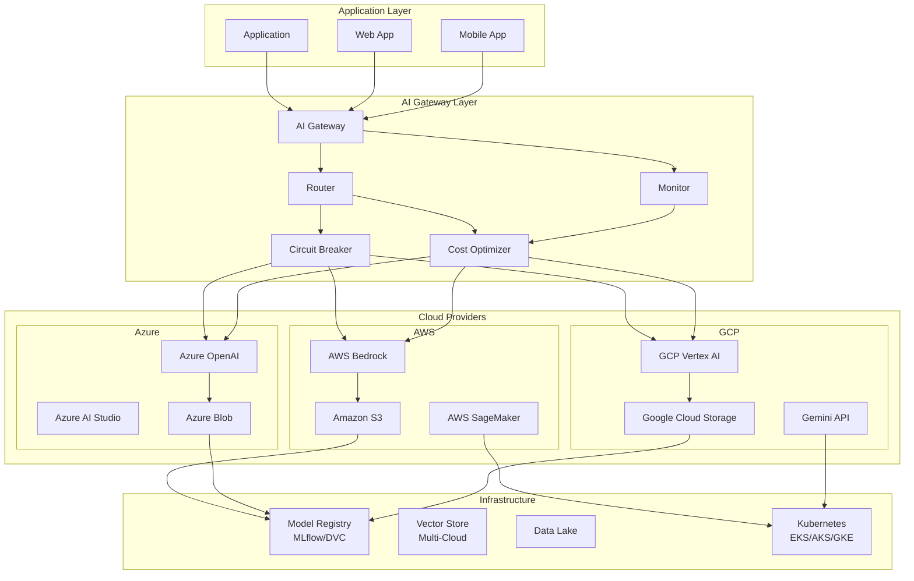

# 03 — Multi-Cloud AI Architecture

## Architecture Patterns for Multi-Cloud AI Deployments

This document presents architectural patterns for building AI systems that operate across multiple cloud providers. It covers abstraction layer design, routing strategies, failover mechanisms, cost-aware decisioning, latency optimization, data gravity considerations, and model portability at the infrastructure level.

---

## Table of Contents

1. Guiding Principles
2. Reference Architecture Overview
3. Abstraction Layer Design
4. Traffic Routing Patterns
5. Failover and Resilience Strategies
6. Cost-Aware Routing
7. Latency-Based Routing
8. Data Gravity Considerations
9. Model Portability Architecture
10. Multi-Cloud Networking
11. Security Architecture
12. Observability Across Clouds
13. Deployment Strategies
14. Reference Implementation: Abstracted AI Gateway
15. Architecture Decision Records (ADRs)
16. Anti-Patterns and Pitfalls

---

## 1. Guiding Principles

The following principles guide all multi-cloud AI architecture decisions:

**1. Abstract the AI Layer, Not the Infrastructure.** Build abstraction at the AI API level (model invocation, embeddings, fine-tuning), not at the infrastructure level (compute, storage, networking). Infrastructure abstraction adds complexity without enabling provider switching.

**2. Default to Cloud-Native, Abstract Only What Varies.** Not every AI capability needs abstraction. Use each cloud's native services for what they do best. Abstract only the capabilities that change between providers (model APIs, vector stores, cost structures).

**3. Assume Providers Are Unreliable.** Build for the case where any provider can go down at any time. Multi-cloud is a resilience strategy, not just a procurement strategy.

**4. Data Movement Is the Primary Cost Driver.** Data transfer costs dominate multi-cloud operating expenses. Architect to minimize cross-cloud data movement. Use intermediate object stores and data lakes as data exchange points.

**5. Standardize on Model Formats, Not Model APIs.** Use ONNX, TensorFlow SavedModel, or PyTorch as standard model formats. The abstraction layer translates between your standardized format and each cloud's inference API.

**6. Measure Everything.** If you can't measure latency, cost, and error rates per provider, you can't optimize routing decisions. Every provider interaction must be instrumented.

**7. Design for Gradual Migration.** Multi-cloud is a journey, not a destination. Start with a single provider, add abstraction for the most critical workload, then expand. Big-bang migrations fail.

---

## 2. Reference Architecture Overview

```
                           ┌─────────────────────────────┐
                           │     Application Layer        │
                           │  (Web App, Mobile, Service)  │
                           └─────────────┬───────────────┘
                                         │
                           ┌─────────────▼───────────────┐
                           │    AI Gateway / Router       │
                           │  (Routing, Failover, Cost)   │
                           └──────┬──────────┬───────────┘
                                  │          │
                  ┌───────────────┼──────────┼───────────────┐
                  │               │          │               │
          ┌───────▼───────┐ ┌────▼────┐ ┌───▼──────┐ ┌─────▼─────┐
          │   AWS Bedrock  │ │  Azure  │ │   GCP    │ │   OCI     │
          │   / SageMaker  │ │ OpenAI  │ │ Vertex AI│ │ AI Serv.  │
          └───────┬───────┘ └────┬────┘ └───┬──────┘ └─────┬─────┘
                  │              │          │               │
          ┌───────▼───────┐ ┌────▼────┐ ┌───▼──────┐ ┌─────▼─────┐
          │   Model Store  │ │ Vector  │ │ Training │ │  Data     │
          │   (S3, ONNX)   │ │ DB      │ │ Compute  │ │ Lake      │
          └────────────────┘ └─────────┘ └──────────┘ └───────────┘
```

The architecture has four layers:
1. **Application Layer** — Consumes AI capabilities through a unified API
2. **AI Gateway/Router** — Routes requests, handles failover, tracks costs
3. **Cloud Provider Layer** — Multiple cloud AI services
4. **Infrastructure Layer** — Model storage, vector databases, training compute

---

## 3. Abstraction Layer Design

### 3.1 What to Abstract

| Capability | Abstract? | Rationale |
|---|---|---|
| **Model inference (text, chat, completion)** | ✅ Yes | APIs differ per provider |
| **Embedding generation** | ✅ Yes | Format and dimensions vary |
| **Vector database operations** | ✅ Yes | Provider-specific, but interface can be unified |
| **Fine-tuning APIs** | ⚠️ Partial | Core operations (create, evaluate, deploy) are similar |
| **Model training** | ❌ No | Too infrastructure-dependent; use native tools |
| **Content safety/filtering** | ⚠️ Partial | Use provider-native for latency, abstract for consistency |
| **Agent orchestration** | ❌ No | Each provider's agent framework is too different |
| **Monitoring and observability** | ✅ Yes | Must be unified for cross-provider comparison |
| **Cost tracking** | ✅ Yes | Essential for routing decisions |
| **IAM/authentication** | ❌ No | Use federated identity instead of abstracting |

### 3.2 Abstraction Layer Interface

```python
# Abstract AI Gateway Interface (pseudocode)
class AIProvider:
    async def chat_completion(
        self,
        model: str,
        messages: list[dict],
        temperature: float = 0.0,
        max_tokens: int = 1024,
        stream: bool = False,
        **kwargs
    ) -> ChatResponse: ...
    
    async def generate_embeddings(
        self,
        texts: list[str],
        model: str = "default",
        **kwargs
    ) -> list[EmbeddingResponse]: ...
    
    async def rerank(
        self,
        query: str,
        documents: list[str],
        model: str = "default"
    ) -> list[RankedResult]: ...
    
    async def check_moderation(
        self,
        content: str,
        **kwargs
    ) -> ModerationResult: ...
    
    def estimate_cost(
        self,
        model: str,
        input_tokens: int,
        output_tokens: int
    ) -> float: ...
```

### 3.3 Provider Adapters

Each cloud provider gets an adapter implementing the abstract interface:

```python
class AWSBedrockAdapter(AIProvider):
    """Adapter for AWS Bedrock API"""
    def __init__(self, config: dict):
        self.client = boto3.client("bedrock-runtime", ...)
        self.cost_table = load_cost_table("aws_bedrock_pricing.csv")
        
    async def chat_completion(self, model, messages, **kwargs):
        # Translate to Bedrock's request format
        bedrock_body = self._to_bedrock_format(model, messages, kwargs)
        
        if kwargs.get("stream"):
            response = self.client.invoke_model_with_response_stream(...)
            return self._parse_stream(response)
        else:
            response = self.client.invoke_model(...)
            return self._parse_response(response)
    
    def estimate_cost(self, model, input_tokens, output_tokens):
        pricing = self.cost_table.get(model)
        return (input_tokens * pricing.input_rate) + \
               (output_tokens * pricing.output_rate)

class AzureOpenAIAdapter(AIProvider):
    """Adapter for Azure OpenAI Service"""
    def __init__(self, config: dict):
        self.client = AsyncAzureOpenAI(
            api_key=config["api_key"],
            api_version="2025-01-01-preview",
            azure_endpoint=config["endpoint"]
        )
        self.cost_table = load_cost_table("azure_pricing.csv")
    
    async def chat_completion(self, model, messages, **kwargs):
        response = await self.client.chat.completions.create(
            model=model,
            messages=messages,
            temperature=kwargs.get("temperature", 0.0),
            max_tokens=kwargs.get("max_tokens", 1024),
            stream=kwargs.get("stream", False)
        )
        return self._to_unified_response(response)
```

### 3.4 Registry Pattern

```python
class ProviderRegistry:
    """Registry of AI provider adapters"""
    def __init__(self):
        self.providers: dict[str, AIProvider] = {}
        self.default_provider: str = None
    
    def register(self, name: str, provider: AIProvider):
        self.providers[name] = provider
    
    def get(self, name: str = None) -> AIProvider:
        return self.providers.get(name or self.default_provider)
    
    def list_providers(self) -> list[str]:
        return list(self.providers.keys())

# Usage
registry = ProviderRegistry()
registry.register("aws", AWSBedrockAdapter(aws_config))
registry.register("azure", AzureOpenAIAdapter(azure_config))
registry.register("gcp", GCPVertexAIAdapter(gcp_config))
```

---

## 4. Traffic Routing Patterns

### 4.1 Round-Robin Routing

Simple distribution across providers. Useful for testing and load balancing when all providers have similar cost and performance.

```python
class RoundRobinRouter:
    def __init__(self, providers: list[str]):
        self.providers = providers
        self.counter = 0
    
    def select_provider(self, request: AIRequest) -> str:
        provider = self.providers[self.counter % len(self.providers)]
        self.counter += 1
        return provider
```

### 4.2 Sticky Session Routing

Route all requests from a user/session to the same provider. Ensures consistency for conversational AI.

```python
class StickySessionRouter:
    def __init__(self, providers: list[str]):
        self.providers = providers
        self.session_map: dict[str, str] = {}
    
    def select_provider(self, request: AIRequest) -> str:
        session_id = request.session_id
        if session_id not in self.session_map:
            self.session_map[session_id] = random.choice(self.providers)
        return self.session_map[session_id]
```

### 4.3 Geographic Routing

Route users to the nearest geographic region/provider combination.

```python
class GeographicRouter:
    def __init__(self, region_map: dict[str, list[str]]):
        self.region_map = region_map  # e.g., {"us-east": ["aws:us-east-1", "azure:eastus"], "eu-west": ["azure:westeurope", "gcp:europe-west1"]}
    
    def select_provider(self, request: AIRequest) -> tuple[str, str]:
        user_region = self._detect_region(request)
        candidates = self.region_map.get(user_region, [])
        # Pick the best provider-region based on current health
        return self._pick_best(candidates)
```

### 4.4 Semantic Routing

Route based on the type of task. Use the best model for each task type.

```python
class SemanticRouter:
    """Route by task type to the optimal model/provider"""
    
    TASK_ROUTES = {
        "chat": {"provider": "azure", "model": "gpt-4o"},
        "code": {"provider": "aws", "model": "claude-3.5-sonnet"},
        "reasoning": {"provider": "azure", "model": "o1-mini"},
        "creative": {"provider": "gcp", "model": "gemini-2.0-pro"},
        "summarization": {"provider": "gcp", "model": "gemini-2.0-flash"},
        "classification": {"provider": "aws", "model": "titan-text-lite"},
        "embedding": {"provider": "azure", "model": "text-embedding-3-small"},
    }
    
    def select_provider(self, request: AIRequest) -> tuple[str, str]:
        task_type = self._classify_task(request.messages)
        route = self.TASK_ROUTES.get(task_type, self.TASK_ROUTES["chat"])
        return route["provider"], route["model"]
```

---

## 5. Failover and Resilience Strategies

### 5.1 Active-Passive Failover

Primary provider handles all traffic; secondary (or tertiary) takes over when primary is degraded.

```python
class ActivePassiveRouter:
    def __init__(self, primary: str, secondaries: list[str], health_checker):
        self.primary = primary
        self.secondaries = secondaries
        self.health = health_checker
    
    async def select_provider(self, request: AIRequest) -> str:
        if await self.health.is_healthy(self.primary):
            return self.primary
        for secondary in self.secondaries:
            if await self.health.is_healthy(secondary):
                return secondary
        raise AllProvidersUnavailableError()
```

### 5.2 Active-Active with Graceful Degradation

All providers serve traffic simultaneously. If one fails, traffic is redistributed.

```python
class ActiveActiveRouter:
    def __init__(self, providers: list[str], weights: list[float], health_checker):
        assert len(providers) == len(weights)
        self.providers = providers
        self.weights = weights
        self.health = health_checker
    
    async def select_provider(self, request: AIRequest) -> str:
        # Get only healthy providers with their weights
        healthy = []
        total_weight = 0.0
        for provider, weight in zip(self.providers, self.weights):
            if await self.health.is_healthy(provider):
                healthy.append((provider, weight))
                total_weight += weight
        if not healthy:
            raise AllProvidersUnavailableError()
        # Normalize weights and pick
        r = random.uniform(0, total_weight)
        cumulative = 0.0
        for provider, weight in healthy:
            cumulative += weight
            if r <= cumulative:
                return provider
        return healthy[-1][0]
```

### 5.3 Circuit Breaker Pattern

Prevent cascading failures by stopping requests to a failing provider.

```python
class CircuitBreaker:
    def __init__(self, failure_threshold: int = 5, recovery_timeout: int = 30):
        self.failure_count = 0
        self.failure_threshold = failure_threshold
        self.recovery_timeout = recovery_timeout
        self.last_failure_time = 0
        self.state = "closed"  # closed, open, half-open
    
    def record_success(self):
        self.failure_count = 0
        self.state = "closed"
    
    def record_failure(self):
        self.failure_count += 1
        if self.failure_count >= self.failure_threshold:
            self.state = "open"
            self.last_failure_time = time.time()
    
    def allow_request(self) -> bool:
        if self.state == "closed":
            return True
        if self.state == "open":
            if time.time() - self.last_failure_time > self.recovery_timeout:
                self.state = "half-open"
                return True
            return False
        if self.state == "half-open":
            return True  # Allow one trial request
        return False
```

### 5.4 Retry with Backoff

```python
async def call_with_retry(provider: AIProvider, request: AIRequest, max_retries: int = 3):
    for attempt in range(max_retries):
        try:
            return await provider.chat_completion(**request)
        except (RateLimitError, ServiceUnavailableError) as e:
            if attempt == max_retries - 1:
                raise
            wait_time = (2 ** attempt) + random.uniform(0, 1)
            logger.warning(f"Provider failed, retrying in {wait_time:.1f}s: {e}")
            await asyncio.sleep(wait_time)
    raise MaxRetriesExceededError()
```

---

## 6. Cost-Aware Routing

### 6.1 Pure Cost-Based Routing

Always route to the cheapest provider for the requested model.

```python
class CostOptimizedRouter:
    def __init__(self, cost_tracker):
        self.cost_tracker = cost_tracker
    
    def select_provider(self, request: AIRequest) -> str:
        model = request.model
        providers = self.cost_tracker.get_available_providers(model)
        # Sort by estimated cost for this request
        sorted_providers = sorted(
            providers,
            key=lambda p: self.cost_tracker.estimate_cost(
                p, model, request.estimated_input_tokens, request.max_tokens
            )
        )
        return sorted_providers[0]
```

### 6.2 Cost-Constrained Latency Optimization

Meet a cost budget while minimizing latency.

```python
class CostConstrainedLatencyRouter:
    def __init__(self, model_perf_db, cost_db, max_cost_per_request: float):
        self.model_perf = model_perf_db  # {(provider, model): avg_latency_ms}
        self.cost_db = cost_db  # {(provider, model): cost_per_token}
        self.max_cost = max_cost_per_request
    
    def select_provider(self, request: AIRequest) -> str:
        candidates = []
        for (provider, model), cost in self.cost_db.items():
            if model == request.model:
                est_cost = cost * request.estimated_tokens
                if est_cost <= self.max_cost:
                    latency = self.model_perf.get((provider, model), float('inf'))
                    candidates.append((provider, latency, est_cost))
        if not candidates:
            # Relax cost constraint, pick cheapest
            candidates = sorted(candidates, key=lambda c: c[2])  # by cost
            return candidates[0][0]
        # Pick lowest latency within cost constraint
        return min(candidates, key=lambda c: c[1])[0]
```

### 6.3 Dynamic Weight Adjustment

Automatically shift traffic based on real-time cost data.

```python
class DynamicWeightRouter:
    def __init__(self, initial_weights: dict[str, float], adaptation_rate: float = 0.1):
        self.weights = initial_weights  # {provider: weight}
        self.adaptation_rate = adaptation_rate
    
    def update_weights(self, cost_report: dict[str, float]):
        """Adjust weights based on observed costs"""
        avg_cost = sum(cost_report.values()) / len(cost_report)
        for provider, cost in cost_report.items():
            if cost < avg_cost:
                # Increase weight for cheaper providers
                self.weights[provider] *= (1 + self.adaptation_rate)
            else:
                self.weights[provider] *= (1 - self.adaptation_rate)
        # Normalize
        total = sum(self.weights.values())
        for provider in self.weights:
            self.weights[provider] /= total
    
    def select_provider(self, request: AIRequest) -> str:
        return random.choices(
            list(self.weights.keys()),
            weights=list(self.weights.values())
        )[0]
```

---

## 7. Latency-Based Routing

### 7.1 P50/P99 Latency Routing

Track latency percentiles per provider and route to the fastest.

```python
class LatencyOptimizedRouter:
    def __init__(self, latency_tracker, window_size: int = 100):
        self.latency_tracker = latency_tracker  # {(provider, model): list of recent latencies}
        self.window_size = window_size
    
    def select_provider(self, request: AIRequest) -> str:
        model = request.model
        provider_latencies = {}
        for (provider, m), latencies in self.latency_tracker.items():
            if m == model and len(latencies) >= 5:  # Need minimum samples
                # Use P50 for normal, P99 for latency-sensitive
                latencies.sort()
                p50 = latencies[len(latencies) // 2]
                provider_latencies[provider] = p50
        
        if not provider_latencies:
            # Fall back to default or round-robin
            return self.fallback_router.select_provider(request)
        
        return min(provider_latencies, key=provider_latencies.get)
```

### 7.2 Geographic Latency Optimization

```python
async def get_geographic_latency(user_region: str, provider_regions: list[str]) -> dict[str, float]:
    """Measure or estimate network latency from user region to each provider region"""
    # Use cloud provider latency benchmarks or RUM data
    pass

class GeoLatencyRouter:
    def __init__(self, latency_matrix: dict[str, dict[str, float]]):
        self.latency_matrix = latency_matrix
    
    def select_provider_region(self, user_location: str) -> tuple[str, str]:
        """Select provider+region with lowest latency to user"""
        best_provider = None
        best_region = None
        best_latency = float('inf')
        for provider, regions in LATENCY_MATRIX.get(user_location, {}).items():
            for region, latency in regions.items():
                if latency < best_latency:
                    best_latency = latency
                    best_provider = provider
                    best_region = region
        return best_provider, best_region
```

---

## 8. Data Gravity Considerations

### 8.1 The Data Gravity Principle

Data gravity describes the tendency of applications and services to be attracted to where data resides. The cost and difficulty of moving large datasets mean that AI workloads should ideally be deployed where the data already lives.

**Data Gravity Math:**
- Moving 10TB across cloud regions costs ~$1,000–2,000 in egress fees
- Moving 10TB between cloud providers costs ~$5,000–10,000
- Training dataset sizes in 2026: 500GB (fine-tuning) to 50TB+ (pre-training)
- Vector database sizes: 100GB to 20TB+ for enterprise RAG

### 8.2 Data Gravity-Aware Architecture

```python
class DataGravityRouter:
    """Route AI workloads based on where the data lives"""
    
    def __init__(self, data_locations: dict[str, str]):
        # data_locations = {"project_x_training_data": "aws:us-east-1", "customer_vectors": "azure:eastus"}
        self.data_locations = data_locations
    
    def select_provider_for_data(self, dataset_name: str) -> tuple[str, str]:
        """Select provider+region where dataset already lives"""
        location = self.data_locations.get(dataset_name)
        if not location:
            return self.default_region
        provider, region = location.split(":")
        return provider, region
    
    def minimize_cross_cloud_transfers(self, required_datasets: list[str]) -> dict:
        """Determine optimal distribution of compute vs data movement"""
        provider_counts = {}
        for dataset in required_datasets:
            location = self.data_locations.get(dataset, "unknown:unknown")
            provider = location.split(":")[0]
            provider_counts[provider] = provider_counts.get(provider, 0) + 1
        
        # Route to the provider with the most co-located data
        return max(provider_counts, key=provider_counts.get)
```

### 8.3 Cross-Cloud Data Exchange Patterns

| Pattern | Description | When to Use |
|---|---|---|
| **Direct egress** | Compute in Cloud A reads data from Cloud B | Small datasets (<1TB), infrequent |
| **Replicated storage** | Data copied to multiple clouds' object stores | High-read workloads, latency-sensitive |
| **Federated query** | Query across clouds without moving data | Analytics, rare access |
| **Data lake hub** | Central data lake (e.g., on AWS S3) with compute in multiple clouds | Large datasets, multiple consumers |
| **Staging and sync** | Periodic batch sync of training data to all clouds | Training, scheduled workloads |

### 8.4 Replication Strategy Example (AWS S3 to GCP GCS)

```yaml
# Cross-cloud data replication using Apache Kafka or cloud-native tools
replication:
  source:
    provider: aws
    service: s3
    bucket: ai-training-data
    region: us-east-1
  destinations:
    - provider: gcp
      service: gcs
      bucket: ai-training-data-replica
      region: us-central1
    - provider: azure
      service: blob
      container: ai-training-data
      region: eastus
  sync_strategy: 
    type: incremental  # or full
    frequency: daily
    compress: true
  cost_tracking:
    enabled: true
    alert_threshold_usd: 1000
```

---

## 9. Model Portability Architecture

### 9.1 Model Storage and Registry

Models should be stored in cloud-agnostic formats and registered in a central model registry:

```
┌─────────────────────────────────────────────┐
│           Central Model Registry              │
│  (MLflow / DVC / Custom)                     │
│                                              │
│  Model A v1  ── ONNX format                  │
│  Model A v2  ── ONNX format                  │
│  Model B v1  ── TensorFlow SavedModel        │
│  Model C v1  ── PyTorch TorchScript          │
└────┬────────────────────────────────────┬────┘
     │                                    │
     ▼                                    ▼
┌─────────┐                         ┌─────────┐
│ AWS S3  │                         │ GCP GCS │
│ ONNX    │                         │ ONNX    │
│ Models  │                         │ Models  │
└─────────┘                         └─────────┘
```

### 9.2 Containerized Model Deployment

```dockerfile
# Dockerfile for cloud-agnostic model serving
FROM nvidia/cuda:12.4-runtime-ubuntu22.04

# Install model server
RUN pip install --no-cache-dir \
    torch==2.2.0 \
    onnxruntime-gpu==1.17.0 \
    transformers==4.38.0 \
    fastapi==0.109.0 \
    uvicorn==0.27.0

# Model files (mounted at runtime, not baked in)
ENV MODEL_PATH=/models
ENV MODEL_FORMAT=onnx

COPY serve.py /app/serve.py
WORKDIR /app

EXPOSE 8080
CMD ["uvicorn", "serve:app", "--host", "0.0.0.0", "--port", "8080"]
```

### 9.3 Multi-Cloud Model Deployment Strategy

```
┌──────────────────────────────────────────────┐
│          GitOps / ArgoCD / Flux               │
│  (k8s manifests per cloud cluster)            │
└──────┬──────────┬──────────┬─────────────────┘
       │          │          │
       ▼          ▼          ▼
┌──────────┐ ┌────────┐ ┌──────────┐
│ AWS EKS  │ │ AKS    │ │ GKE      │
│ Cluster  │ │ Cluster│ │ Cluster  │
│          │ │        │ │          │
│ Model A  │ │ Model A│ │ Model B  │
│ (ONNX)   │ │ (ONNX) │ │ (Torch)  │
└──────────┘ └────────┘ └──────────┘
```

---

## 10. Multi-Cloud Networking

### 10.1 Network Topology Options

| Topology | Description | Use Case | Complexity |
|---|---|---|---|
| **Hub-and-spoke** | Central hub (e.g., AWS Transit Gateway) connects to spoke VPCs | Centralized security, moderate scale | Medium |
| **Mesh** | Direct connections between all cloud VPCs | Maximum throughput, low latency | High |
| **Cloud router** | Cloud-agnostic SD-WAN (e.g., Aviatrix, Alkira) | Unified policy, simplified management | Medium-High |
| **Internet-based** | TLS/TCP over public internet | Simple, non-production | Low |

### 10.2 Connectivity Patterns

```hcl
# Terraform: AWS to Azure Private Connectivity
resource "aws_vpc_peering_connection" "aws_to_azure" {
  # Note: VPC peering is AWS-internal only
  # For cross-cloud, use Direct Connect + ExpressRoute
}

resource "aws_dx_private_virtual_interface" "main" {
  connection_id    = aws_dx_connection.main.id
  name             = "aws-to-azure-vif"
  vlan             = 100
  address_family   = "ipv4"
  bgp_asn          = 64512
}

# Azure ExpressRoute circuit connects to same MSEE
resource "azurerm_express_route_circuit" "main" {
  name                  = "express-route-main"
  location              = azurerm_resource_group.main.location
  resource_group_name   = azurerm_resource_group.main.name
  service_provider_name = "Equinix"
  peering_location      = "Silicon Valley"
  bandwidth_in_mbps     = 1000
  sku {
    tier   = "Standard"
    family = "MeteredData"
  }
}
```

### 10.3 DNS and Service Discovery

```yaml
# Cross-cloud DNS routing with Route53 / Azure DNS / Cloud DNS
# Use a global DNS load balancer (e.g., Google Global Load Balancer, 
# AWS Route53 with health checks, or Azure Traffic Manager)
global_ai_endpoint:
  dns: ai-gateway.organization.com
  routing:
    - provider: aws
      region: us-east-1
      endpoint: ai-gateway.us-east-1.aws.internal
      weight: 40
    - provider: azure
      region: eastus
      endpoint: ai-gateway.eastus.azure.internal
      weight: 40
    - provider: gcp
      region: us-central1
      endpoint: ai-gateway.us-central1.gcp.internal
      weight: 20
  health_check:
    path: /health
    interval: 10s
    timeout: 5s
    unhealthy_threshold: 3
```

---

## 11. Security Architecture

### 11.1 Federated Identity

```yaml
# Use OIDC federation across clouds
security:
  identity:
    provider: Okta/Azure AD/Ping
    protocol: OIDC
    federation:
      - cloud: aws
        role_mapping: 
          - oidc_group: ai-engineers
            aws_role: arn:aws:iam::123456789:role/AIEngineer
      - cloud: azure
        role_mapping:
          - oidc_group: ai-engineers
            azure_role: AI-Engineer@organization.com
      - cloud: gcp
        role_mapping:
          - oidc_group: ai-engineers
            gcp_role: projects/my-project/roles/aiEngineer
```

### 11.2 Secrets Management

```yaml
# Use a centralized secrets manager like HashiCorp Vault
secrets:
  provider: vault
  address: https://vault.organization.com
  ai_api_keys:
    aws_bedrock:
      path: secret/ai/aws/bedrock-api-key
    azure_openai:
      path: secret/ai/azure/openai-api-key
      fields:
        - api_key
        - endpoint
    gcp_vertex:
      path: secret/ai/gcp/service-account-json
```

### 11.3 Network Security

```
                    ┌──────────────────────────┐
                    │   AI Gateway (DMZ)        │
                    │   Public endpoint         │
                    └─────────┬────────────────┘
                              │ TLS 1.3
          ┌───────────────────┼───────────────────┐
          │                   │                   │
          ▼                   ▼                   ▼
┌─────────────────┐ ┌─────────────────┐ ┌─────────────────┐
│ AWS VPC         │ │ Azure VNet      │ │ GCP VPC         │
│ PrivateLink     │ │ Private Endpoint │ │ Private Service │
│ Bedrock VPC End │ │ OpenAI Endpoint │ │ Connect         │
└─────────────────┘ └─────────────────┘ └─────────────────┘
          │                   │                   │
          ▼                   ▼                   ▼
    ┌──────────────┐  ┌──────────────┐  ┌──────────────┐
    │ KMS Keys     │  │ Key Vault    │  │ Cloud KMS    │
    │ Encryption   │  │ Encryption   │  │ Encryption   │
    └──────────────┘  └──────────────┘  └──────────────┘
```

---

## 12. Observability Across Clouds

### 12.1 Unified Observability Stack

```yaml
observability:
  metrics:
    collector: prometheus-operator  # Running on dedicated monitoring cluster
    exporters:
      - cloud: aws
        scraper: cloudwatch-exporter
        metrics:
          - bedrock_invocation_count
          - bedrock_latency_p50
          - bedrock_error_rate
          - sagemaker_inference_cost
      - cloud: azure
        scraper: azure-monitor-exporter
        metrics:
          - openai_request_count
          - openai_latency
          - openai_tokens_processed
          - openai_throttled_requests
      - cloud: gcp
        scraper: google-cloud-monitoring-exporter
        metrics:
          - vertex_ai_prediction_count
          - vertex_ai_prediction_latencies
          - vertex_ai_model_compute_usage
  logging:
    aggregator: grafana-loki / elasticsearch
    sources:
      - ai_gateway_logs
      - provider_proxy_logs
      - model_server_logs
  tracing:
    backend: grafana-tempo / jaeger
    instrumentation: opentelemetry
    sampling:
      default: 5%
      high_traffic_endpoints: 1%
      error_traces: 100%
  dashboards:
    - name: Multi-Cloud AI Cost Dashboard
      metrics: [cost_per_provider, cost_per_model, cost_per_team]
    - name: Multi-Cloud AI Latency Dashboard
      metrics: [p50_latency, p99_latency, latency_by_provider, latency_by_region]
    - name: Multi-Cloud AI Reliability Dashboard
      metrics: [uptime, error_rate_by_provider, circuit_breaker_state, failover_events]
```

### 12.2 Cost Attribution Across Clouds

```python
# Unified cost tagging across providers
cost_tags = {
    "team": "ml-platform",
    "project": "customer-support-bot",
    "environment": "production",
    "cost_center": "CC-AI-2024",
    "model": "claude-3.5-sonnet",
    "workload_type": "inference"
}

# AWS
aws_tag_spec = [
    {"Key": "team", "Value": "ml-platform"},
    {"Key": "project", "Value": "customer-support-bot"},
]

# Azure
azure_tags = {
    "team": "ml-platform",
    "project": "customer-support-bot",
}

# GCP
gcp_labels = {
    "team": "ml-platform",
    "project": "customer-support-bot",
}
```

---

## 13. Deployment Strategies

### 13.1 Phased Adoption

```
Phase 1: Single Cloud + Gateway
├── One primary cloud provider
├── AI Gateway in front
├── Basic cost tracking
└── Model registry established

Phase 2: Second Cloud (Non-Critical)
├── Add secondary cloud provider
├── Route non-critical traffic
├── Load testing and validation
├── Cross-cloud monitoring
└── Failover procedures documented

Phase 3: Production Multi-Cloud
├── Active-active or active-passive production
├── Cost-aware routing enabled
├── Full observability stack
├── Automated failover
└── FinOps processes established

Phase 4: Optimized Multi-Cloud
├── Dynamic routing (cost, latency, task)
├── Cross-cloud training
├── Federated learning (if needed)
├── AI-powered routing optimization
└── Continuous cost optimization
```

### 13.2 GitOps for Multi-Cloud AI

```yaml
# argo-cd application for multi-cloud AI deployment
apiVersion: argoproj.io/v1alpha1
kind: ApplicationSet
metadata:
  name: multi-cloud-ai
spec:
  generators:
    - clusters:
        selector:
          matchLabels:
            ai-workload: enabled
  template:
    metadata:
      name: 'ai-inference-{{name}}'
    spec:
      project: default
      source:
        repoURL: https://github.com/org/ai-models-gitops
        targetRevision: HEAD
        path: 'deployments/{{metadata.labels.cloud}}/'
      destination:
        server: '{{server}}'
        namespace: ai-inference
      syncPolicy:
        automated:
          prune: true
          selfHeal: true
```

---

## 14. Reference Implementation: Abstracted AI Gateway

```python
# ai_gateway.py — Simplified multi-cloud AI gateway
import asyncio
import logging
from dataclasses import dataclass
from typing import Optional
from datetime import datetime

logger = logging.getLogger(__name__)

@dataclass
class AIRequest:
    messages: list[dict]
    model: str = "gpt-4o"
    temperature: float = 0.0
    max_tokens: int = 1024
    stream: bool = False
    session_id: Optional[str] = None
    user_id: Optional[str] = None
    task_type: Optional[str] = None

@dataclass
class AIResponse:
    content: str
    model: str
    provider: str
    input_tokens: int
    output_tokens: int
    latency_ms: float
    cost: float
    timestamp: datetime

class HealthChecker:
    async def is_healthy(self, provider: str) -> bool:
        # Check provider health via circuit breaker and health endpoint
        pass

class CostTracker:
    def estimate_cost(self, provider: str, model: str, input_tokens: int, output_tokens: int) -> float:
        pass

class MultiCloudAIGateway:
    def __init__(self, registry: ProviderRegistry, router, health: HealthChecker, cost: CostTracker):
        self.registry = registry
        self.router = router
        self.health = health
        self.cost = cost
    
    async def chat_completion(self, request: AIRequest) -> AIResponse:
        provider_name = await self.router.select_provider(request)
        provider = self.registry.get(provider_name)
        
        start = asyncio.get_event_loop().time()
        
        try:
            response = await provider.chat_completion(
                model=request.model,
                messages=request.messages,
                temperature=request.temperature,
                max_tokens=request.max_tokens,
                stream=request.stream
            )
        except Exception as e:
            logger.error(f"Provider {provider_name} failed: {e}")
            # Failover to next provider
            provider_name = await self.router.failover(request, exclude=[provider_name])
            provider = self.registry.get(provider_name)
            response = await provider.chat_completion(...)
        
        latency = (asyncio.get_event_loop().time() - start) * 1000
        cost = self.cost.estimate_cost(
            provider_name, request.model,
            response.usage.input_tokens,
            response.usage.output_tokens
        )
        
        return AIResponse(
            content=response.content,
            model=request.model,
            provider=provider_name,
            input_tokens=response.usage.input_tokens,
            output_tokens=response.usage.output_tokens,
            latency_ms=latency,
            cost=cost,
            timestamp=datetime.utcnow()
        )

# Usage
gateway = MultiCloudAIGateway(
    registry=registry,
    router=CostOptimizedRouter(cost_tracker),
    health=health_checker,
    cost=cost_tracker
)

response = await gateway.chat_completion(
    AIRequest(messages=[{"role": "user", "content": "Hello!"}], model="gpt-4o")
)
print(f"Provider: {response.provider}, Cost: ${response.cost:.4f}")
```

---

## 15. Architecture Decision Records (ADRs)

### ADR-001: Abstraction Level

**Decision:** Abstract at the AI API layer (chat completion, embeddings, reranking) rather than infrastructure layer.

**Rationale:**
- Infrastructure abstraction adds complexity without enabling provider switching
- AI API interfaces are converging (OpenAI-compatible format)
- Infrastructure differences (IAM, networking, storage) are unavoidable and abstracting them adds fragility

**Consequences:**
- Each provider needs an adapter implementing the standard interface
- Providers with unique capabilities (e.g., Gemini's 2M context window) still accessible via provider-specific options

### ADR-002: Router Placement

**Decision:** Deploy the AI gateway/router as a dedicated service, not as a library or sidecar.

**Rationale:**
- Centralized routing enables consistent cost tracking, rate limiting, and observability
- Libraries require per-service updates; a service can be updated independently
- Enables circuit breaker state to be shared across all consuming services

**Consequences:**
- Gateway becomes a single point of failure (mitigate with active-active deployment)
- Adds one network hop (typically <5ms via private networking)

### ADR-003: Model Format Standard

**Decision:** Use ONNX as the primary portable model format, with TensorFlow SavedModel and PyTorch TorchScript supported.

**Rationale:**
- ONNX is the most broadly supported format across cloud providers
- Converter tools available from all major frameworks
- Performance gap vs. native format is minimal (0-5% for most models)

**Consequences:**
- Some model architectures not supported by ONNX (use native format with fallback)
- Conversion validation must be part of CI/CD pipeline

---

## 16. Anti-Patterns and Pitfalls

### Anti-Pattern 1: Premature Abstraction

**Problem:** Abstracting everything before understanding what needs to vary.

**Solution:** Start with one provider, add abstraction only when adding a second provider for a specific capability.

### Anti-Pattern 2: Ignoring Data Transfer Costs

**Problem:** Routinely moving data between clouds for every inference call.

**Solution:** Co-locate compute with data. Use batch replication for training data. Cache inference results locally.

### Anti-Pattern 3: Uniform Routing Without Provider Differences

**Problem:** Treating all providers as interchangeable and routing blindly.

**Solution:** Understand each provider's strengths (latency, cost, model quality) and route accordingly.

### Anti-Pattern 4: Over-Engineering the Gateway

**Problem:** Building a generic gateway that supports every possible provider feature.

**Solution:** Implement only the features you need now. Extend when adding a new provider requires it.

### Anti-Pattern 5: Neglecting Operational Complexity

**Problem:** Building the architecture without considering operational burden.

**Solution:** Invest in automation (GitOps, infrastructure as code) and unified observability from day one.

### Anti-Pattern 6: False Portability

**Problem:** Assuming ONNX or containerization guarantees identical behavior.

**Solution:** Verify model output quality per provider in staging. Expect minor differences due to framework-specific optimizations.

### Anti-Pattern 7: No Exit Strategy

**Problem:** Building on a cloud's proprietary AI service without a migration plan.

**Solution:** For every cloud-native AI service used, document: (1) what it provides, (2) what the alternative is on other clouds, (3) migration complexity.

---

## Appendix: Architecture Diagram (Mermaid)



---

## References

- Document 02: Cloud AI Platform Comparison (for provider-specific details)
- Document 04: Model Portability and Interoperability (for model format details)
- Document 05: Multi-Cloud AI Cost Management (for cost optimization strategies)
- Document 08: AI Gateway and Router Patterns (for gateway implementation)
- AWS Well-Architected Framework — Multi-Region Architecture
- Azure Architecture Center — Multi-Cloud Solutions
- Google Cloud Architecture Framework — Hybrid and Multi-Cloud
