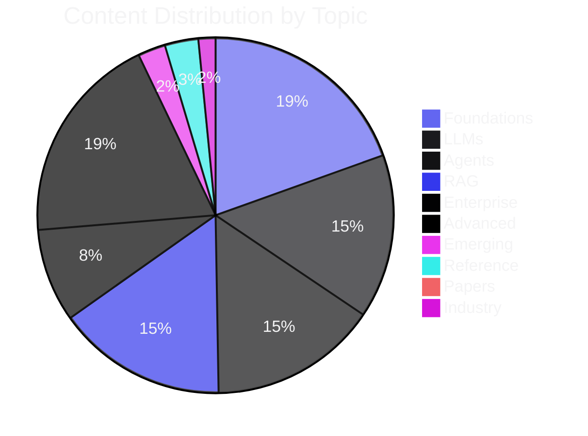

<div align="center">

# 📖 AI Library of Alexandria

### *The Most Comprehensive Open-Source AI Knowledge Base*

[](https://github.com/hernanda-git/ai-knowledge-library/stargazers)
[](https://github.com/hernanda-git/ai-knowledge-library/network)
[](LICENSE)
[](https://github.com/hernanda-git/ai-knowledge-library/commits/main)
[](#-document-index)
[](#-statistics)

---

```text
   ╔══════════════════════════════════════════════════════════════════╗
   ║           AI LIBRARY OF ALEXANDRIA                               ║
   ║           46 Documents · 53,404 Lines · 2.1 MB                   ║
   ║           Auto-enriching every 12 hours                          ║
   ╚══════════════════════════════════════════════════════════════════╝
```

[**[ 🌐 Live Site ](#-quick-start)**]
[**[ 📚 Document Index ](#-document-index)**]
[**[ 🧭 Study Pathways ](#-study-pathways)**]
[**[ ⚡ Quick Start ](#-quick-start)**]
[**[ 📊 Statistics ](#-statistics)**]

---

> **A unified, cross-referenced, self-improving knowledge base covering the ENTIRE landscape of modern AI** — from mathematical foundations and deep learning theory to LLMs, agents, RAG, enterprise deployment, multimodal AI, safety, interpretability, data engineering, and the future roadmap. Built by parallel AI agents working together, enriched every 12 hours.

</div>

---

## 📋 Overview

The AI Library of Alexandria is a comprehensive study resource that covers the full AI stack — organized into **10 topic directories** across **46 documents** with **53,404 lines** of technical content.

### Architecture

```
┌──────────────────────────────────────────────────────────────┐
│                   AI LIBRARY OF ALEXANDRIA                    │
├──────────────────────────────────────────────────────────────┤
│  01-Foundations/     ML, Deep Learning, Training, Data Eng   │
│  02-LLMs/            Transformer, Models, Tokenization, NLP  │
│  03-Agents/          Agents, Multi-Agent, Frameworks, MCP    │
│  04-RAG/             RAG, Advanced RAG, Vector Databases     │
│  05-Enterprise/      Deployment, Fine-Tuning, Infra          │
│  06-Advanced/        Multimodal, Diffusion, Eval, Prompt     │
│  07-Emerging/        Research Frontiers, Safety, Governance  │
│  08-Reference/       Glossary, Roadmap, SOUL/SKILL Configs   │
│  09-Papers/          50+ Foundational AI Papers              │
│  10-Industry/        Industry Applications, Economics        │
├──────────────────────────────────────────────────────────────┤
│  web/pages/          12 Topic HTML Pages (study portal)      │
│  generate.py         Python static site generator            │
│  app/                Next.js 15 + TypeScript                 │
└──────────────────────────────────────────────────────────────┘
```

---

## 🧭 Study Pathways

Choose your learning path based on your role:

<table>
<thead>
<tr><th width="30">🎯</th><th width="180">Path</th><th>Learning Sequence</th></tr>
</thead>
<tbody>
<tr>
<td>🧠</td>
<td><strong>ML Engineer</strong></td>
<td><code>Mathematics</code> → <code>ML Foundations</code> → <code>Deep Learning</code> → <code>Training Methodologies</code></td>
</tr>
<tr>
<td>🔧</td>
<td><strong>LLM Engineer</strong></td>
<td><code>Transformer Architecture</code> → <code>Model Families</code> → <code>Tokenization</code> → <code>Quantization</code> → <code>Prompt Engineering</code> → <code>Evaluation</code></td>
</tr>
<tr>
<td>🤖</td>
<td><strong>Agent Developer</strong></td>
<td><code>Agent Architectures</code> → <code>MCP/ACP</code> → <code>Multi-Agent Systems</code> → <code>Agentic Frameworks</code> → <code>Tools</code></td>
</tr>
<tr>
<td>📚</td>
<td><strong>RAG Specialist</strong></td>
<td><code>RAG Architectures</code> → <code>Advanced RAG</code> → <code>Vector Databases</code></td>
</tr>
<tr>
<td>🏭</td>
<td><strong>Enterprise Architect</strong></td>
<td><code>Deployment</code> → <code>Fine-Tuning</code> → <code>Infrastructure</code> → <code>Evaluation</code></td>
</tr>
<tr>
<td>🚀</td>
<td><strong>AI Researcher</strong></td>
<td><code>Diffusion Models</code> → <code>Multimodal AI</code> → <code>Interpretability</code> → <code>AI Safety</code> → <code>Papers</code></td>
</tr>
<tr>
<td>🛡️</td>
<td><strong>Safety Practitioner</strong></td>
<td><code>AI Safety</code> → <code>Interpretability</code> → <code>Governance</code> → <code>Adversarial ML</code> → <code>Privacy</code></td>
</tr>
</tbody>
</table>

---

## 📚 Document Index

### 01 — Foundations (10 docs · 10,324 lines)

| Document | Lines | Topics |
|----------|:-----:|--------|
| `02-Machine-Learning.md` | 1,960 | Supervised, Unsupervised, Self-Supervised, RL, Statistical Learning, Loss Functions, Optimization, Regularization, Ensemble Methods |
| `03-Deep-Learning.md` | 2,115 | Perceptron → MLP → CNN → RNN → Transformer, Backpropagation, Normalization, Attention |
| `05-Training-Methodologies.md` | 3,275 | Pre-training, Fine-tuning (LoRA/QLoRA/DoRA), RLHF, DPO, Scaling Laws, Curriculum Learning, Alignment |
| `01-LLM-and-AI-Models.md` | 1,387 | LLM Architecture, Quantization, Inference, Prompt Engineering Library, Speculative Decoding |
| `04-Data-Engineering.md` | 626 | Collection, Quality Filtering, Deduplication, Decontamination, Synthetic Data, Data Governance |
| `06-Reinforcement-Learning.md` | 350 | MDPs, DQN, PPO, SAC, MuZero, RLHF, GRPO, Multi-Agent RL |
| `07-Graph-Neural-Networks.md` | 167 | GCN, GAT, Message Passing, Spectral Methods, Applications |
| `08-Mathematics-for-ML.md` | 172 | Linear Algebra, Probability, Calculus, Statistics, Information Theory |
| `09-Federated-Learning-Privacy.md` | 148 | Federated Learning, Differential Privacy, SMPC, HE |
| `10-Causal-Inference.md` | 124 | Causal Graphs, Potential Outcomes, ATE/CATE, Discovery |

### 02 — LLMs (5 docs · 7,892 lines)

| Document | Lines | Topics |
|----------|:-----:|--------|
| `01-Transformer-Architecture.md` | 1,388 | Scaled Dot-Product Attention, Multi-Head, RoPE, FlashAttention, GQA/MQA/MLA |
| `02-Model-Families.md` | 2,343 | GPT, LLaMA, Claude, Gemini, DeepSeek, Mistral, Qwen — Benchmarks, Comparisons |
| `03-Tokenization.md` | 1,962 | BPE, WordPiece, Unigram, SentencePiece, tiktoken, Vocab Sizes |
| `04-Quantization.md` | 1,974 | GGUF, GPTQ, AWQ, bitsandbytes, AQLM, QuIP# — Precision Types, Hardware |
| `05-NLP-Foundations.md` | 225 | POS Tagging, Parsing, NER, Coreference, MT, Summarization, QA |

### 03 — Agents (5 docs · 8,085 lines)

| Document | Lines | Topics |
|----------|:-----:|--------|
| `01-Agent-Architectures.md` | 1,063 | Agent vs Orchestrator, ReAct, 8-Step Workflow, 5 Orchestration Patterns |
| `02-Multi-Agent-Systems.md` | 2,722 | Communication, Coordination, Agent Teams, Debate, MoA |
| `03-Agentic-Frameworks.md` | 2,513 | LangGraph, CrewAI, AutoGen, Semantic Kernel, DSPy — 20-Dimension Comparison |
| `04-Protocols-MCP-ACP.md` | 1,121 | MCP 3-Tier Architecture, Transports, Lifecycle, ACP Discovery |
| `05-Tool-Implementations.md` | 666 | Hermes Agent vs Claude Code vs OpenCode — Full Comparison |

### 04 — RAG (3 docs · 8,179 lines)

| Document | Lines | Topics |
|----------|:-----:|--------|
| `01-RAG-Architectures.md` | 829 | Indexing, Retrieval, Generation, Chunking, Embeddings, Evaluation |
| `02-Advanced-RAG.md` | 3,626 | GraphRAG, Self-RAG, CRAG, Agentic RAG, Hybrid Search, Re-ranking |
| `03-Vector-Databases.md` | 3,724 | Faiss, Chroma, Pinecone, Qdrant, Weaviate, Milvus, pgvector — 20-Dim Comparison |

### 05 — Enterprise (3 docs · 4,490 lines)

| Document | Lines | Topics |
|----------|:-----:|--------|
| `01-Enterprise-AI-Deployment.md` | 1,011 | vLLM, TGI, Triton, K8s, Monitoring, Cost Optimization, Security, Compliance |
| `03-Fine-Tuning-Enterprise.md` | 3,377 | LoRA/QLoRA/DoRA, Data Pipeline, Axolotl, Unsloth, TRL, RLHF Pipeline |
| `04-AI-Infrastructure.md` | 102 | GPU Architecture, Cluster Design, Parallelism, Networking |

### 06 — Advanced (10 docs · 10,153 lines)

| Document | Lines | Topics |
|----------|:-----:|--------|
| `01-Multimodal-AI.md` | 1,970 | ViT, YOLO, SAM, Stable Diffusion, Sora, Whisper, CLIP, LLaVA, GPT-4V |
| `02-Diffusion-Models.md` | 411 | DDPM, DDIM, Latent Diffusion, CFG, Score-Based, Flow Matching |
| `03-Evaluation-Benchmarks.md` | 3,414 | MMLU, GSM8K, HumanEval, SWE-bench, LLM-as-Judge, Contamination |
| `04-Prompt-Engineering.md` | 3,027 | 20+ Techniques, DSPy, APE, Injection Defense, Structured Output |
| `05-Interpretability.md` | 569 | SAEs, Circuits, Activation Patching, Probing, Logit Lens, RepE |
| `06-Recommendation-Systems.md` | 215 | CF, Two-Tower, Ranking, Candidate Generation, A/B Testing |
| `07-Time-Series-Forecasting.md` | 139 | ARIMA, Prophet, DeepAR, TFT, N-BEATS, Anomaly Detection |
| `08-Adversarial-ML.md` | 174 | Evasion, Poisoning, Extraction, Jailbreaking, Defenses |
| `09-AI-UX-and-Interaction.md` | 155 | Conversation Design, Trust, Error Handling, Evaluation Metrics |
| `10-AutoML-NAS.md` | 79 | HPO, NAS, DARTS, ENAS, Frameworks |

### 07 — Emerging (3 docs · 1,329 lines)

| Document | Lines | Topics |
|----------|:-----:|--------|
| `01-Emerging-AI-Research.md` | 614 | Test-time Compute, Watermarking, AI4Science, Frontier Models, Hardware |
| `02-AI-Safety.md` | 585 | Alignment, RLHF Limitations, Constitutional AI, Red Teaming, Catastrophic Risks |
| `03-AI-Governance.md` | 130 | EU AI Act, US Policy, China Regulation, RSPs, Corporate Governance |

### 08 — Reference (3 docs · 1,614 lines)

| Document | Lines | Topics |
|----------|:-----:|--------|
| `01-Glossary.md` | 358 | 65+ Unified Terms with Cross-References |
| `02-AI-Roadmap.md` | 486 | 2026-2030+ Outlook, Trends, Recommendations |
| `03-Agent-Configs-SOUL-SKILL.md` | 770 | SOUL.md Identity, SKILL.md Procedures, CLAUDE.md, .cursorrules |

### 09 — Papers (1 doc · 515 lines)

| Document | Lines | Topics |
|----------|:-----:|--------|
| `01-Foundational-Papers.md` | 515 | 50+ Landmark AI Papers with Summaries, Contributions, Citations |

### 10 — Industry (3 docs · 823 lines)

| Document | Lines | Topics |
|----------|:-----:|--------|
| `01-AI-Industry-Applications.md` | 609 | Healthcare, Finance, Legal, Education, Dev, Media, Retail, 13 Industries |
| `02-AI-Economics.md` | 119 | Market Size, Training Costs, Labor Impact, Productivity Gains |
| `03-AI-for-Robotics.md` | 95 | VLA Models, RT-2, Octo, Sim-to-Real, Hardware Platforms |

---

## ⚡ Quick Start

### Option 1: Static Site (No Build Required)

```bash
# Generate the static HTML site
python3 generate.py

# Open out/index.html in your browser
```

### Option 2: Next.js Development Server

```bash
# Install dependencies
npm install

# Start dev server
npm run dev

# Open http://localhost:3000
```

### Option 3: Production Build

```bash
npm run build
npm start
```

---

## 🛠️ Tech Stack

<div align="center">

| Component | Technology |
|-----------|------------|
| **Frame work** | [Next.js 15](https://nextjs.org/) + [TypeScript](https://www.typescriptlang.org/) |
| **Styling** | Custom CSS with CSS Variables (Dark Theme) |
| **Static Gen** | Python 3 (generate.py) |
| **Content** | 46 Markdown Documents · 53,404 Lines |
| **Hosting** | GitHub Pages / Vercel / Static anywhere |

</div>

---

## 📊 Statistics

<div align="center">

| Metric | Value |
|:-------|:-----:|
| 📁 **Total Documents** | **46** |
| 📐 **Topic Directories** | **10** |
| 📝 **Total Lines** | **53,404** |
| 💾 **Total Size** | **2.1 MB** |
| 📈 **Largest Document** | Vector-Databases.md (3,724 lines) |
| 🏢 **Largest Directory** | 01-Foundations (10,324 lines) |
| 🚀 **Docs > 3,000 lines** | 7 |
| 🔄 **Auto-enrichment** | Every 12 hours |
| 🌐 **Study Portal Pages** | 14 HTML pages |

</div>



---

## 🔄 Auto-Enrichment

This knowledge base is **alive**. A cron job runs every 12 hours that:

1. 📡 Scans for gaps in coverage
2. 🌐 Searches the web for latest AI developments
3. 📝 Creates new documents on missing topics
4. 📈 Updates existing documents with new findings
5. 🔗 Maintains cross-references and consistent terminology

> *"Never stop gathering all knowledge."*

---

## 📄 License

[MIT](LICENSE) © Hernanda @valversum

---

<div align="center">

**Built with 🤖 by AI agents working in parallel, unified into a single coherent body of knowledge.**

[](https://github.com/hernanda-git/ai-knowledge-library)
[](https://hermes-agent.nousresearch.com)
[](.)

</div>
